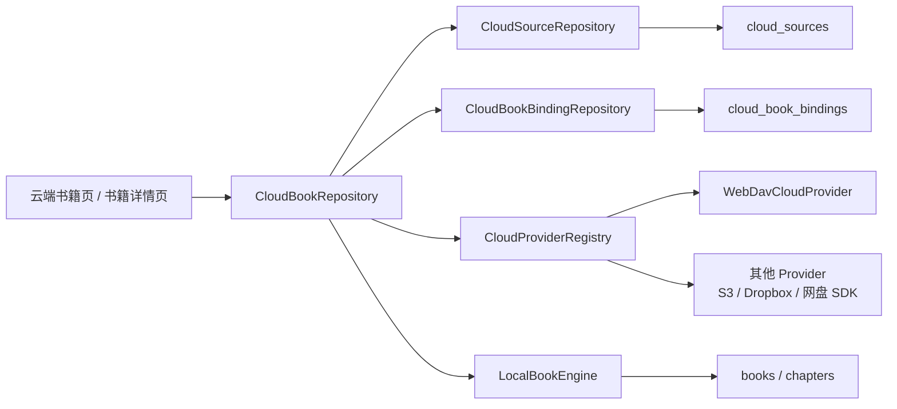
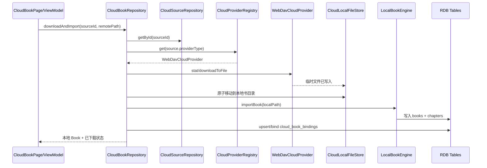

# 云端书籍模块设计

> 状态：设计完成；阶段 0–4、**6** 已落地（阶段 5 暂缓）。  
> 更新日期：2026-07-24  
> 目标：提供可管理多个 WebDAV 网盘、并可扩展到其他云存储协议的云端书库；云端文件下载并导入后，始终作为普通本地书籍进入书架。  
> 各阶段实现说明已整合至 §18 实现计划对应小节。

---

## 1. 背景、范围与核心原则

Android Legado 已支持 WebDAV 远程书籍：浏览远程目录、下载文件、导入本地书架、上传本地书，以及后续手动同步。鸿蒙端已有 WebDAV 备份与阅读进度同步，但尚未实现远程书库。

本模块的范围是**云端文件书籍**（TXT、EPUB、MOBI、AZW、AZW3、PDF，以及后续可支持的压缩书籍包），不包括书源网站的在线章节阅读。

### 1.1 产品原则

1. **云端与本地分离**：云端书籍页展示远程文件；书架只展示已导入且可离线打开的本地 `Book`。
2. **下载后即本地书**：远程文件下载完成后，进入现有 `LocalBookEngine` 导入流程；不创建“远程阅读器”，也不要求阅读时联网。
3. **来源可追溯**：本地书可关联零个、一个或多个云端副本，用于上传、检查更新和手动同步；关联关系不能改变该书的本地属性。
4. **多来源隔离**：每个云盘来源独立保存地址、凭证和根目录；同名文件、相同目录名、不同服务商之间不得互相影响。
5. **协议可扩展**：业务层依赖通用云存储 Provider，不直接依赖 WebDAV；WebDAV 是首个 Provider。
6. **用户确认优先**：远端文件变化时标记“可更新”，由用户确认后下载并重新导入；不静默覆盖本地文件。

### 1.2 非目标

- 不把 WebDAV 或其他网盘实现为流式在线阅读、随机远程读取 EPUB/PDF。
- 不绕过登录、验证码、DRM、付费墙或云盘的访问控制。
- 第一阶段不支持断点续传、服务端文件移动追踪或多端编辑冲突自动合并。
- 不复用备份 WebDAV 配置作为唯一书库配置；备份、进度同步与云端书库可以共用网络基础设施，但配置和业务模型独立。

---

## 2. 术语与路径语义

| 名称 | 含义 |
|---|---|
| 云端来源（Cloud Source） | 用户配置的一个云盘入口，例如一个 WebDAV 服务器账户。 |
| Provider | 某个云存储协议的实现，例如 `webdav`；负责协议请求，不包含书籍 UI 或数据库业务。 |
| 根目录（rootPath） | 用户为**该来源单独设置**的远端目录。进入来源后直接展示此目录的内容。可为空，表示服务地址本身。 |
| 相对路径（remotePath） | 文件或子目录相对于 `rootPath` 的规范化路径；根目录自身使用空字符串。 |
| 云端条目（CloudFile） | Provider 返回的目录或文件元数据，不等同于 `Book`。 |
| 云端副本关联（CloudBookBinding） | 一个本地 `Book` 与一个云端文件之间的持久化关联。 |

### 2.1 根目录规则

根目录是来源配置的一部分，不存在全局固定的 `books/` 子目录。

```text
来源 A
  endpoint = https://dav.example.com/dav/
  rootPath = legado/books
  进入来源时请求：https://dav.example.com/dav/legado/books/

来源 B
  endpoint = https://cloud.example.com/remote.php/dav/files/alice/
  rootPath = Reading
  进入来源时请求：https://cloud.example.com/remote.php/dav/files/alice/Reading/

来源 C
  endpoint = https://dav.example.org/library/
  rootPath = ""
  进入来源时请求：https://dav.example.org/library/
```

约束：

- `rootPath` 是相对 `endpoint` 的目录路径；保存时去除首尾 `/`，空值合法。
- 进入来源、刷新、返回面包屑根节点时都调用 `list(source, '')`，即直接列出根目录内容。
- `rootPath` 不在来源初始化时自动创建，也不自动追加 `books/`。用户可在配置页测试连接，并在云端页按需创建子目录。
- `remotePath` 不允许 `..`、空路径段或未规范化的反斜杠，防止路径逃逸。
- Provider 必须将 URI 编码、WebDAV 返回的绝对/相对 `href` 差异收敛为规范化 `remotePath`；上层不得拼接未经处理的 URL。

---

## 3. 用户功能与状态

### 3.1 云端书籍页

入口为“云端书籍”。页面顶部可切换或管理来源，进入某来源后立即展示其 `rootPath` 下的内容。

支持：

- 来源选择、新增、编辑、删除、连接测试；
- 文件夹进入、返回、面包屑定位到任意层级；
- 刷新、按名称搜索、名称/修改时间排序；
- 下载单本或批量下载；
- 已下载书籍的打开、检查更新、从云端重新下载；
- 本地书上传到指定来源及当前目录；
- 目录创建和远端删除（必须二次确认，且与“删除本地书”分开）。

### 3.2 云端文件显示状态

状态由 `CloudBookBinding` 和本地文件实际存在性共同决定，不能仅按文件名判断。

| 状态 | 显示标记 | 主操作 |
|---|---|---|
| `CLOUD_ONLY` | 云端 | 下载并加入书架 |
| `DOWNLOADING` | 下载中 | 显示进度、取消 |
| `DOWNLOADED` | 已下载 | 打开本地书 |
| `OUTDATED` | 可更新 | 确认后从云端更新 |
| `ERROR` | 下载失败 | 重试、查看错误 |

目录不显示下载状态。仅当云端文件与 Binding 的 `sourceId + remotePath` 精确匹配，且关联的本地 Book 与文件仍存在时，才显示“已下载”。

### 3.3 本地书架语义

- 下载成功后的书通过 `LocalBookEngine` 入库，`Book.bookUrl` 为本地路径，`Book.origin` 保持本地书语义，正常显示在书架。
- 书架不展示“云端”书，不因来源离线、被删除或账号失效而不能打开本地书。
- 书籍详情页增加“云端副本”区域：展示关联来源、远端路径、最后检查时间与状态，并提供上传、同步、解绑和删除远端副本操作。
- 删除本地书时提供“仅从书架删除”和“同时删除云端副本”两个明确选项；默认仅删除本地书。前者会将 Binding 的 `bookId` 置空，使云端页恢复“云端”状态。
- 删除来源时只删除来源配置及其 Binding；不得删除任何本地 Book、Chapter 或本地文件。

---

## 4. 架构



### 4.1 分层职责

| 层 | 职责 | 禁止承担的职责 |
|---|---|---|
| `CloudStorageProvider` | 认证、目录列举、文件元数据、上传、下载、删除、建目录 | UI 状态、Book 入库、书架判断 |
| `CloudProviderRegistry` | 按 `providerType` 创建/获取 Provider | 保存来源密码、拼装书籍业务 |
| `CloudSourceRepository` | 来源配置 CRUD、凭证安全存取、连接测试 | 下载并导入书籍 |
| `CloudBookRepository` | 浏览、Binding 查询、下载导入、上传、更新检查、同步 | 直接实现 HTTP/WebDAV XML |
| 页面/ViewModel | 展示状态、调度任务、进度与确认交互 | SQL、协议解析 |
| `LocalBookEngine` | 将已落地的本地文件解析为 `Book`、`Chapter` | 云端请求与来源鉴权 |

### 4.2 Provider 接口

```ts
type CloudProviderType = 'webdav' | string;

interface CloudStorageProvider {
  readonly type: CloudProviderType;

  testConnection(source: CloudSource): Promise<void>;
  list(source: CloudSource, remotePath: string, cursor?: string): Promise<CloudListPage>;
  stat(source: CloudSource, remotePath: string): Promise<CloudFile | null>;

  downloadToFile(
    source: CloudSource,
    remotePath: string,
    tempPath: string,
    onProgress?: (received: number, total?: number) => void
  ): Promise<void>;

  uploadFile(
    source: CloudSource,
    localPath: string,
    remotePath: string,
    onProgress?: (sent: number, total?: number) => void
  ): Promise<CloudFile>;

  createDirectory?(source: CloudSource, remotePath: string): Promise<void>;
  delete?(source: CloudSource, remotePath: string): Promise<void>;
}
```

`CloudFile` 至少包含 `remotePath`、`name`、`isDirectory`、`size`、`modifiedAt`、`etag?`、`contentType?`。`CloudListPage` 保留 `nextCursor?`，使后续分页型网盘无需改变 Repository 接口。

### 4.3 WebDAV Provider 要求

`WebDavCloudProvider` 是首个实现，协议映射如下：

| Provider 方法 | WebDAV 实现 |
|---|---|
| `testConnection` | `OPTIONS` 或 `PROPFIND Depth: 0`，明确处理 401/403 |
| `list` | `PROPFIND Depth: 1`，保留文件、目录与必要元数据 |
| `stat` | `PROPFIND Depth: 0` |
| `downloadToFile` | `GET` 写入临时文件 |
| `uploadFile` | `PUT` 上传本地文件 |
| `createDirectory` | `MKCOL` |
| `delete` | `DELETE` |

现有 `WebDavService` 可复用 Basic Auth、RCP 请求和 XML 基础能力，但云端书库 Provider 必须独立于备份/进度同步服务。尤其不能沿用现有 `parsePropfindResponse()` 过滤目录的行为，因为云端书库需要目录导航。

---

## 5. 数据设计

### 5.1 `cloud_sources`

```text
id                 INTEGER PRIMARY KEY
name               TEXT NOT NULL
provider_type      TEXT NOT NULL                 -- 初始值 webdav
endpoint           TEXT NOT NULL
root_path          TEXT NOT NULL DEFAULT ''      -- 每个来源独立配置
config_json        TEXT NOT NULL DEFAULT '{}'
credential_ref     TEXT NOT NULL                 -- 指向 SettingsStore 的安全凭证
enabled            INTEGER NOT NULL DEFAULT 1
sort_number        INTEGER NOT NULL DEFAULT 0
created_at         INTEGER NOT NULL
updated_at         INTEGER NOT NULL
```

- WebDAV 的 `config_json` 可存储非敏感参数，例如请求超时、字符集或服务端兼容选项。
- 用户名、密码、Token 等敏感内容不得进入 `config_json`、日志或备份明文；通过 `credential_ref` 从 `SettingsStore` 获取。
- `endpoint + root_path` 不作为唯一键：同一端点可用不同账户或不同根目录创建多个独立来源。

### 5.2 `cloud_book_bindings`

```text
id                 INTEGER PRIMARY KEY
source_id          INTEGER NOT NULL
book_id            INTEGER NULL                  -- 未下载或本地删除时为空
remote_path        TEXT NOT NULL                  -- 相对于 source.root_path
remote_id          TEXT NULL                      -- Provider 支持稳定 ID 时使用
file_name          TEXT NOT NULL
size               INTEGER NOT NULL DEFAULT 0
modified_at        INTEGER NOT NULL DEFAULT 0
etag               TEXT NULL
content_type       TEXT NULL
downloaded_at      INTEGER NULL
last_checked_at    INTEGER NULL
last_synced_at     INTEGER NULL
sync_state         TEXT NOT NULL                  -- CLOUD_ONLY/DOWNLOADED/OUTDATED/ERROR
last_error         TEXT NULL
created_at         INTEGER NOT NULL
updated_at         INTEGER NOT NULL

UNIQUE(source_id, remote_path)
INDEX(book_id)
```

一个 `Book` 可以关联多个 Binding，例如同时上传至家庭 NAS 和个人云盘；一个云端文件最多绑定当前来源中的一个本地 Book。

### 5.3 与既有 `books` 表的关系

不为云端书新增 `Book.origin = webDav::...` 等特殊编码。下载导入后沿用本地书数据：

```text
Book.bookUrl  = local://<本地沙箱文件路径>
Book.origin   = 本地
Book.isShelf  = 1
Book.canUpdate = 0
```

云端同步能力只由 `cloud_book_bindings` 提供。这保证现有书架筛选、阅读、缓存、删除和备份逻辑继续把它当作普通本地书处理。

---

## 6. 核心流程

### 6.1 配置并进入来源

```text
用户保存来源（endpoint、用户名/密码、rootPath）
  → CloudSourceRepository 保存非敏感配置和 credentialRef
  → Provider.testConnection(source)
  → 云端书籍页调用 provider.list(source, '')
  → 直接显示 source.rootPath 下的文件与目录
```

来源新增/编辑后的连接测试失败不得覆盖或删除原有可用配置；页面应显示可理解的认证、网络或协议错误。

### 6.2 浏览云端目录

```text
根目录：list(source, '')
进入目录 foo：list(source, 'foo')
进入目录 foo/bar：list(source, 'foo/bar')
返回根目录：list(source, '')
```

页面仅将 Provider 返回的目录项视为可进入；文件仅在扩展名被当前 `LocalBookEngine` 支持时可下载导入。未支持文件可显示，但不提供“加入书架”。

### 6.3 下载并导入

```text
用户点击“下载并加入书架”
  → 写入/更新 Binding：syncState = DOWNLOADING
  → Provider.downloadToFile() 写入 files/cloudbook/.tmp/<taskId>
  → 校验文件非空、扩展名和可读性
  → 原子移动到 files/books/ 下的安全文件名
  → LocalBookEngine.importBook()
  → 事务写入 Binding.bookId、远端元数据和 DOWNLOADED 状态
  → 书架显示普通本地书；云端页显示“已下载”
```

下载必须使用临时文件。取消、网络断开、校验失败或导入失败时删除临时文件，Binding 标记 `ERROR`，不得留下半文件或半成品 Book。

### 6.4 上传本地书

```text
用户在书籍详情选择“上传到云端”
  → 选择来源与目标目录（默认当前来源根目录）
  → Provider.uploadFile(localPath, targetPath)
  → Provider.stat() 获取 etag / modifiedAt / size
  → upsert CloudBookBinding(sourceId, bookId, remotePath)
  → 本地书保持“本地”属性，云端页显示“已下载”
```

同名文件是否覆盖必须由 UI 明确确认。覆盖成功后更新该 `(sourceId, remotePath)` 的 Binding，不能通过文件名猜测关联。

### 6.5 更新检查与手动同步

```text
检查更新
  → Provider.stat(source, binding.remotePath)
  → etag 优先；没有 etag 时比较 modifiedAt + size
  → 有变化：Binding = OUTDATED

用户确认“从云端更新”
  → 下载至临时文件
  → 调用 LocalBookEngine 重新导入
  → 保留旧书的书架排序、分组和阅读进度
  → 原子替换 Binding.bookId 与远端元数据
```

若远端文件不存在，Binding 标记为错误/已移除来源，不删除本地书。第一阶段不自动上传本地修改来解决冲突。

---

## 7. 页面与交互约束

### 7.1 来源管理页

WebDAV 来源编辑项：名称、服务器地址、账号、密码、**根目录**、测试连接、启用状态。

- 根目录输入框的说明为：“进入此来源时直接显示该目录内容；留空表示服务器根目录。”
- 显示规范化预览 URL，但不得在 UI 或日志中输出密码。
- 删除来源前提示“不会删除已下载到书架的本地书籍”。

### 7.2 云端书籍页

- 顶部显示来源名称和根目录面包屑；根节点名称使用来源名或根目录显示名，而不是硬编码 `books`。
- 文件行展示名称、大小、修改时间、云端状态标记；目录行展示进入箭头。
- “已下载”项点击优先打开本地 Book；本地文件缺失时降级为“云端”。
- 多选下载应展示总数、成功/失败数量和逐项错误；一个文件失败不应取消其他文件。

### 7.3 深浅色模式

所有新增页面和组件遵循项目主题规范：使用 `ThemeColors` 和 `@StorageLink('isDark')`，不硬编码颜色；云端、已下载、可更新、错误状态使用语义化颜色 Token。

---

## 8. 实现计划与验收

### 阶段 1：数据与 Provider 基础

1. 新增 `cloud_sources`、`cloud_book_bindings` 表及 DAO/Migration。
2. 实现 `CloudStorageProvider`、`CloudProviderRegistry`、`WebDavCloudProvider`。
3. 从现有 `WebDavService` 提取可复用的请求/认证能力，保留备份与进度同步兼容行为。
4. 完成根目录规范化、PROPFIND 目录/文件解析、绝对/相对 href 兼容和单元测试。

验收：可配置两个指向不同根目录的 WebDAV 来源，切换后均直接显示各自根目录内容，互不串目录或凭证。

### 阶段 2：浏览、下载与本地导入

1. 新增云端书籍页、来源管理页与目录导航。
2. 实现临时文件下载、进度、取消、失败清理和 `LocalBookEngine` 导入。
3. 写入 Binding，并在云端页准确显示“云端/已下载”。

验收：下载 EPUB/TXT/PDF 后能在书架中作为本地书打开；断网或取消后不产生残留书籍；相同文件名但不同来源不误判为已下载。

### 阶段 3：上传与更新

1. 在书籍详情增加上传、云端副本查看、解绑和删除远端副本。
2. 实现 `stat` 更新检查、可更新状态与用户确认后的重新导入。
3. 实现来源删除、本地书删除和远端删除的边界行为。

验收：上传后的书仍是本地书；远端更新不会自动覆盖；删除来源或云端文件不会使已下载书无法阅读。

### 阶段 4：扩展 Provider

新增 Provider 时仅需实现 `CloudStorageProvider`、来源配置表单与凭证适配。云端书籍页、Binding 表、下载导入和本地阅读链路不应修改。

---

## 9. 测试矩阵

| 场景 | 预期 |
|---|---|
| 两个 WebDAV 来源使用不同 rootPath | 进入后分别展示各自根目录内容，无路径串用。 |
| rootPath 为空 | 直接列出 endpoint 对应根目录。 |
| 根目录含中文、空格、URL 编码字符 | 列表、进入、下载、上传均使用正确的规范化路径。 |
| 同名文件位于不同来源/目录 | Binding 独立，状态不互相污染。 |
| 云端未下载书 | 云端页显示“云端”，不出现在书架。 |
| 下载成功 | 云端页显示“已下载”，书架出现普通本地书且可离线阅读。 |
| 下载取消/失败 | 无半成品文件或 Book，条目显示可重试错误。 |
| 本地书上传 | 本地属性不改变，新增或更新对应 Binding。 |
| 远端文件更新 | 标记“可更新”，用户确认前不覆盖本地内容。 |
| 删除来源/远端文件 | 保留已下载本地书；仅 Binding 失效或删除。 |
| Provider 不支持目录/删除 | UI 根据 Capability 隐藏相应操作，不影响浏览与下载。 |

---

## 10. 关键文件规划

| 文件 | 责任 |
|---|---|
| `entry/src/main/ets/service/cloud/CloudStorageProvider.ts` | Provider 接口、通用模型与能力声明 |
| `entry/src/main/ets/service/cloud/CloudProviderRegistry.ts` | Provider 注册与路由 |
| `entry/src/main/ets/service/cloud/CloudProviderBootstrap.ts` | 集中注册全部 Provider（幂等） |
| `entry/src/main/ets/service/cloud/WebDavCloudProvider.ts` | WebDAV 协议实现 |
| `entry/src/main/ets/service/cloud/LocalFolderCloudProvider.ts` | 本地演示目录 Provider（阶段 7 扩展示例） |
| `entry/src/main/ets/service/cloud/CloudBookRepository.ts` | 浏览、下载导入、上传、同步业务 |
| `entry/src/main/ets/data/database/CloudSourceTable.ts` | `cloud_sources` DAO |
| `entry/src/main/ets/data/database/CloudBookBindingTable.ts` | `cloud_book_bindings` DAO |
| `entry/src/main/ets/model/CloudSource.ts` | 来源和凭证引用模型 |
| `entry/src/main/ets/model/CloudBookBinding.ts` | 本地书-云端副本关联模型 |
| `entry/src/main/ets/pages/CloudBookPage.ets` | 云端书籍浏览与下载页面 |
| `entry/src/main/ets/pages/CloudSourceManagePage.ets` | 来源管理和根目录配置页面 |

现有 `entry/src/main/ets/service/WebDavService.ts` 继续负责备份与阅读进度同步；云端书籍的 WebDAV Provider 与其共享底层网络能力，但不将云端书籍逻辑继续堆积在该文件中。

---

## 11. 详细数据结构

本节定义实现时使用的 ArkTS 领域模型。数据库字段使用 `snake_case`，领域模型使用 `camelCase`；所有路径字段均使用规范化后的相对路径。

### 11.1 新增：云端来源模型

```ts
export type CloudProviderType = 'webdav' | string;

export interface CloudSource {
  id: number;
  name: string;
  providerType: CloudProviderType;

  /** 服务根地址；不包含 rootPath，末尾斜杠由 Provider 处理。 */
  endpoint: string;

  /** 相对 endpoint 的独立根目录；'' 表示 endpoint 自身。 */
  rootPath: string;

  /** Provider 的非敏感配置，例如超时、字符集或兼容选项。 */
  configJson: string;

  /** 凭证保存在 SettingsStore 中的命名空间键，不保存密码本身。 */
  credentialRef: string;
  enabled: boolean;
  sortNumber: number;
  createdAt: number;
  updatedAt: number;
}

export interface WebDavCloudConfig {
  // 用户名和密码都不持久化于本对象；只在凭证读取后短暂传给请求层。
  connectTimeoutMs?: number;
  transferTimeoutMs?: number;
  charset?: string;
}

export interface CloudCredential {
  username: string;
  secret: string;
}
```

`endpoint`、`rootPath` 和 `credentialRef` 的职责必须分开：同一 WebDAV 地址可以配置多个来源，每个来源可以使用不同根目录和账号。来源列表排序仅由 `sortNumber` 决定。

### 11.2 新增：远端文件与 Provider 能力模型

```ts
export interface CloudFile {
  /** 相对于 CloudSource.rootPath，例如 '小说/三体.epub'。 */
  remotePath: string;
  name: string;
  isDirectory: boolean;
  size: number;
  modifiedAt: number;
  etag?: string;
  contentType?: string;
  remoteId?: string;
}

export interface CloudListPage {
  items: CloudFile[];
  nextCursor?: string;
}

export interface CloudProviderCapabilities {
  canCreateDirectory: boolean;
  canDelete: boolean;
  canMove: boolean;
  supportsEtag: boolean;
  supportsRangeDownload: boolean;
}
```

`CloudFile.remotePath` 是跨 Provider 的统一身份。WebDAV 返回 `href` 时，Provider 必须先验证其属于该来源的 `endpoint + rootPath`，再转换为相对路径；不得将服务端返回的 URL 原样暴露给业务层。

### 11.3 新增：本地书与云端副本关联模型

```ts
export type CloudBookSyncState =
  | 'CLOUD_ONLY'
  | 'DOWNLOADED'
  | 'OUTDATED'
  | 'ERROR';

export interface CloudBookBinding {
  id: number;
  sourceId: number;

  /** 已下载并导入时指向 books.id；否则为 null。 */
  bookId: number | null;

  /** 与 sourceId 共同组成稳定唯一键。 */
  remotePath: string;
  remoteId: string;
  fileName: string;
  size: number;
  modifiedAt: number;
  etag: string;
  contentType: string;

  downloadedAt: number;
  lastCheckedAt: number;
  lastSyncedAt: number;
  syncState: CloudBookSyncState;
  lastError: string;
  createdAt: number;
  updatedAt: number;
}
```

`DOWNLOADING` 不写入 Binding 的持久状态。下载任务是进程内瞬态状态，页面通过 `CloudTransferManager` 订阅进度；应用异常退出后，未完成任务在下次进入时被当作未下载或错误任务重新检查，避免永久卡在“下载中”。

### 11.4 新增：页面组合模型

```ts
export type CloudBookDisplayState =
  | 'DIRECTORY'
  | 'CLOUD_ONLY'
  | 'DOWNLOADING'
  | 'DOWNLOADED'
  | 'OUTDATED'
  | 'ERROR';

export interface CloudBookListItem {
  sourceId: number;
  file: CloudFile;
  binding?: CloudBookBinding;
  localBook?: Book;
  displayState: CloudBookDisplayState;
  progress?: { received: number; total?: number };
}
```

`CloudBookListItem` 是 ViewModel 的组合结果，不单独落库。状态计算规则为：目录始终为 `DIRECTORY`；有运行中任务为 `DOWNLOADING`；Binding 关联 Book 且本地文件可访问时为 `DOWNLOADED` 或 `OUTDATED`；其他情况为 `CLOUD_ONLY`；传输/解析失败时为 `ERROR`。

### 11.5 修改：既有 `Book` 模型与 `books` 表

**不新增 WebDAV 字段，也不改变本地书字段语义。** 云端来源、远端路径、ETag、检查时间均保存在 `cloud_book_bindings`。

已有字段的约束如下：

| 既有字段 | 云端书籍下载后的写入规则 | 原因 |
|---|---|---|
| `bookUrl` | `local://<沙箱本地文件>` | 阅读与本地文件定位继续复用现有逻辑。 |
| `origin` | `本地` / `LOCAL_BOOK_ORIGIN` | 书架和阅读逻辑仍将其视为本地书。 |
| `originUrl` | 本地导入规则现有值 | 不写云端 URL，避免和在线书源语义混淆。 |
| `tocUrl` | 保持 LocalBookEngine 的解析结果 | EPUB 解压目录等本地阅读依赖不受影响。 |
| `canUpdate` | `false` | 不让在线书源刷新流程处理云端文件书。 |
| `syncTime` | 继续仅用于阅读进度 WebDAV 同步 | 不复用为云端文件检查时间。 |

因此需要修改的是 Book 删除协调流程，而非 `Book` 表字段：通过 `CloudBookRepository.removeLocalBook()` 先处理 Binding，再调用现有本地文件和 Book/Chapter 删除逻辑。不得在 `BookTable.deleteBook()` 内直接发网络请求。

### 11.6 修改：可上传原始文件不变量

阶段 5 的上传能力**不能**从章节表、EPUB 解压目录或已解析文本反向拼装书籍文件。这会丢失 EPUB 资源、MOBI/PDF 原始结构、编码与元数据，并且对部分格式根本不可行。

当前 `LocalBookEngine` 的正确行为是：先把原始文件复制到应用沙箱 `files/books/`，将该绝对路径写入 `Book.originUrl`，EPUB 另外保存解压目录到 `Book.tocUrl`。原始文件与解压目录都应保留到用户删除本地 Book 时才清理。

云端书籍模块必须把下列规则作为不变量：

```text
可上传本地书
  <=> Book.origin === LOCAL_BOOK_ORIGIN
      && Book.originUrl 指向可读的原始文件

云端下载并导入
  => 先将下载结果原子落盘为最终原始文件
  => 再调用 LocalBookEngine.importBook(finalRawFilePath)
  => 得到的 Book.originUrl 必须等于该最终原始文件路径
```

`CloudBookBinding` 不重复保存本地文件路径，唯一真相仍是关联 `Book.originUrl`。上传、重新下载或同步前必须重新校验该路径可读；不能仅因 Binding 存在便认为存在上传源文件。

对历史版本、手动清理沙箱或文件损坏导致 `originUrl` 不可读的本地书：

- 云端页若已有远端副本，显示“本地文件缺失”，允许重新下载并导入；
- 书籍详情页禁用“上传到云端”和“覆盖远端”，提示重新导入原文件或从已有云端副本下载；
- 不尝试从章节文本/EPUB 解压目录自动重建源文件；
- 若只需解除关联，仍允许解绑或删除远端副本。

---

## 12. 数据库、DAO 与迁移设计

### 12.1 新建表 DDL

```sql
CREATE TABLE IF NOT EXISTS cloud_sources (
  id INTEGER PRIMARY KEY AUTOINCREMENT,
  name TEXT NOT NULL,
  provider_type TEXT NOT NULL,
  endpoint TEXT NOT NULL,
  root_path TEXT NOT NULL DEFAULT '',
  config_json TEXT NOT NULL DEFAULT '{}',
  credential_ref TEXT NOT NULL,
  enabled INTEGER NOT NULL DEFAULT 1,
  sort_number INTEGER NOT NULL DEFAULT 0,
  created_at INTEGER NOT NULL,
  updated_at INTEGER NOT NULL
);

CREATE TABLE IF NOT EXISTS cloud_book_bindings (
  id INTEGER PRIMARY KEY AUTOINCREMENT,
  source_id INTEGER NOT NULL,
  book_id INTEGER,
  remote_path TEXT NOT NULL,
  remote_id TEXT NOT NULL DEFAULT '',
  file_name TEXT NOT NULL,
  size INTEGER NOT NULL DEFAULT 0,
  modified_at INTEGER NOT NULL DEFAULT 0,
  etag TEXT NOT NULL DEFAULT '',
  content_type TEXT NOT NULL DEFAULT '',
  downloaded_at INTEGER NOT NULL DEFAULT 0,
  last_checked_at INTEGER NOT NULL DEFAULT 0,
  last_synced_at INTEGER NOT NULL DEFAULT 0,
  sync_state TEXT NOT NULL DEFAULT 'CLOUD_ONLY',
  last_error TEXT NOT NULL DEFAULT '',
  created_at INTEGER NOT NULL,
  updated_at INTEGER NOT NULL,
  UNIQUE(source_id, remote_path)
);

CREATE INDEX IF NOT EXISTS idx_cloud_bindings_book_id
  ON cloud_book_bindings(book_id);
CREATE INDEX IF NOT EXISTS idx_cloud_bindings_source_id
  ON cloud_book_bindings(source_id);
```

当前数据库采用 `CREATE TABLE IF NOT EXISTS` 与幂等 `ALTER TABLE` 的初始化迁移方式。因此实现时应：

1. 在 `AppDatabase.ts` 导入并执行两个建表 SQL 和索引 SQL；
2. 增加 `cloudSourceTable`、`cloudBookBindingTable` getter，并导出两个 DAO；
3. 不修改 `DATABASE_VERSION` 作为唯一迁移手段；新表的 `CREATE TABLE IF NOT EXISTS` 必须在已有数据库启动时执行；
4. 任何未来新增列都采用可重试的 `ALTER TABLE ... ADD COLUMN`，并提供默认值；
5. 先建 `cloud_sources`，后建 `cloud_book_bindings`。虽然当前 RDB 未强制外键，Repository 必须维护引用完整性。

### 12.2 `CloudSourceTable` 契约

```ts
interface CloudSourceTable {
  listEnabled(): Promise<CloudSource[]>;
  listAll(): Promise<CloudSource[]>;
  getById(id: number): Promise<CloudSource | null>;
  insert(source: CloudSource): Promise<number>;
  update(source: CloudSource): Promise<void>;
  delete(id: number): Promise<void>;
  updateSort(idsInOrder: number[]): Promise<void>;
}
```

保存来源前调用 `CloudPath.normalizeRootPath()`：去首尾斜杠、折叠重复斜杠、拒绝 `.`/`..` 路段和反斜杠；Provider 进一步负责 URL 编码。`delete(id)` 仅删除来源记录，不负责删除 Binding 或凭证，删除编排由 Repository 统一完成。

### 12.3 `CloudBookBindingTable` 契约

```ts
interface CloudBookBindingTable {
  get(sourceId: number, remotePath: string): Promise<CloudBookBinding | null>;
  getById(id: number): Promise<CloudBookBinding | null>;
  listBySource(sourceId: number): Promise<CloudBookBinding[]>;
  listByBook(bookId: number): Promise<CloudBookBinding[]>;
  upsert(binding: CloudBookBinding): Promise<number>;
  updateRemoteMeta(id: number, file: CloudFile, state: CloudBookSyncState): Promise<void>;
  bindBook(id: number, bookId: number, downloadedAt: number): Promise<void>;
  unlinkBook(bookId: number): Promise<void>;
  deleteBySource(sourceId: number): Promise<void>;
  markError(sourceId: number, remotePath: string, message: string): Promise<void>;
}
```

`upsert` 必须以 `(source_id, remote_path)` 为冲突键。禁止以文件名、书名、作者或 `book_id` 判断云端文件是否相同。

### 12.4 凭证存储修改

新增 `CloudCredentialStore`（或扩展 `SettingsStore`）管理来源凭证：

```ts
setCloudCredential(ref: string, credential: CloudCredential): Promise<void>;
getCloudCredential(ref: string): Promise<CloudCredential | null>;
deleteCloudCredential(ref: string): Promise<void>;
```

- 新来源保存前生成随机 `credentialRef`（例如 `cloud-source:<uuid>`）并保存凭证；随后写入来源记录。若数据库写入失败，必须删除刚写入的凭证作为补偿。
- 编辑来源时先测试新凭证，测试成功后再替换旧凭证；失败时旧配置保持可用。
- 云端书籍来源参与备份时只备份来源的非敏感配置；恢复后显示“需要重新填写密码”。
- 日志仅允许记录来源 ID、主机和路径，不得输出 `Authorization`、密码或 Token。

---

## 13. 模块关系与改动清单

### 13.1 新增模块关系



### 13.2 既有模块的修改边界

| 既有模块 | 修改内容 | 不应修改的内容 |
|---|---|---|
| `AppDatabase.ts` | 注册新表、索引、DAO getter 和迁移。 | 不修改既有 Book/Chapter 数据含义。 |
| `BookTable.ts` | 可新增按 ID 查询/事务辅助；删除由上层协调后调用。 | 不加入云端 URL、ETag、来源 ID 字段。 |
| `LocalBookEngine.ts` | 保持导入入口；必要时返回确定的 `bookId` 和清理句柄。 | 不接触 Provider、凭证或远端路径。 |
| `WebDavService.ts` | 提取可复用的认证/RCP/XML 工具，保持备份与阅读进度 API 兼容。 | 不承载来源管理、云端页面状态或 Book Binding。 |
| `SettingsStore.ts` | 增加带命名空间的凭证读取/删除。 | 不把多个云盘密码写入普通 AppStorage。 |
| `BookshelfPage.ets` | 新增“云端书籍”入口；书架查询仍只查本地 `Book`。 | 不将未下载 CloudFile 插入书架。 |
| `BookInfoPage.ets` | 增加“云端副本”面板与上传/同步操作。 | 不把云端状态替代本地阅读状态。 |
| `BackupCodec.ts` | 可导出/恢复非敏感 `cloud_sources` 配置。 | 不备份凭证，也不将云端文件本体打包。 |

### 13.3 文件级实现责任

在第 10 节规划文件的基础上，建议再新增：

| 文件 | 责任 |
|---|---|
| `service/cloud/CloudPath.ts` | rootPath/remotePath 规范化、拼接与路径安全校验 |
| `service/cloud/CloudTransferManager.ts` | 瞬态下载/上传任务、进度、取消和并发限制 |
| `service/cloud/CloudLocalFileStore.ts` | 临时文件、唯一文件名、原子移动、失败清理 |
| `service/cloud/CloudSourceRepository.ts` | 来源与凭证的保存、测试、删除编排 |
| `service/cloud/CloudBookBindingRepository.ts` | Binding 的数据库访问与状态计算 |
| `data/preferences/CloudCredentialStore.ts` | 多来源敏感凭证安全存储 |

---

## 14. 关键流程详细设计

### 14.1 新增或编辑来源

```text
输入 name / endpoint / username / password / rootPath
  → CloudPath.normalizeRootPath(rootPath)
  → 构造未持久化 CloudSource + 临时 CloudCredential
  → Provider.testConnection(source, credential)
  → Provider.list(source, '') 验证根目录可列举
  ├─ 失败：显示错误；不写数据库、不替换旧凭证
  └─ 成功：先写 CloudCredentialStore(credentialRef)
       → 事务写入/更新 cloud_sources
       → DB 写入失败则删除刚写入的凭证作为补偿
       → 返回来源详情；进入时直接展示 rootPath 内容
```

对于根目录不存在的情况，默认报“根目录不可访问”，而不是静默创建。创建根目录必须是用户在配置页或云端页明确触发的操作。

### 14.2 目录列举与状态组合

```text
CloudBookPage 打开 sourceId
  → sourceRepository.getById(sourceId)
  → provider.list(source, currentRemotePath)
  → bindingTable.listBySource(sourceId)
  → 以 remotePath 建 Map，合并为 CloudBookListItem[]
  → 对 bookId 非空的 Binding 批量核验 Book 和本地文件存在性
  → 计算 CLOUD_ONLY / DOWNLOADED / OUTDATED / ERROR
```

初版允许一次读取该来源所有 Binding；当 Binding 数量较大时，DAO 应增加 `listBySourceAndPaths(sourceId, remotePaths)`，避免目录页面全表读取。目录缓存只用于提升体验，用户下拉刷新必须重新调用 Provider。

### 14.3 下载并导入（补偿事务）

文件系统与 RDB 无法构成单一事务，使用“先落地、后导入、失败补偿”的 Saga：

```text
1. 获取来源、Provider 和远端 stat；拒绝目录、未知格式及路径不合法项。
2. CloudTransferManager 创建 taskId，页面状态切为 DOWNLOADING。
3. CloudLocalFileStore 分配唯一临时路径：files/cloudbook/.tmp/<taskId>.part。
4. Provider.downloadToFile() 写入临时文件并报告进度。
5. 校验文件大小（若远端 size > 0）、非空和格式；失败则删除临时文件。
6. 分配唯一最终路径：files/books/cloud_<sourceId>_<pathHash>_<safeName>。
7. 原子 rename 临时文件至最终路径；调用 LocalBookEngine.importBook(finalPath)。
8. RDB transaction：upsert Binding、写入 bookId、远端元数据、DOWNLOADED。
9. 成功：结束任务并刷新书架/云端页面。
10. 失败补偿：删除临时/最终文件；若 LocalBookEngine 已创建 Book，删除其 Chapter、Book、EPUB 解压目录和封面；Binding 标记 ERROR。
```

同一个 `(sourceId, remotePath)` 同时只能有一个活动下载任务；第二次点击返回已有任务句柄。批量下载设定有限并发（建议 2），单项失败不取消其他任务。

### 14.4 上传本地书并建立关联

```text
1. 用户在 BookInfo 选择来源和目标目录；默认目标目录为当前来源 rootPath，即 remotePath = ''。
2. 检查 `Book.origin === LOCAL_BOOK_ORIGIN` 且 `Book.originUrl` 指向可读的原始文件；若不存在则停止并提示重新导入/重新下载。随后检查来源可用、目标目录可写。
3. 将目标路径规范化为 '<targetDir>/<safeOriginalFilename>'；如已存在，展示覆盖确认。
4. Provider.uploadFile(source, localPath, remotePath)；上传成功后调用 stat 获取最新元数据。
5. RDB transaction：以 (sourceId, remotePath) upsert Binding，并 bind 到当前 bookId。
6. 刷新当前目录；该文件显示 DOWNLOADED，本地 Book 不改变 origin/bookUrl/canUpdate。
```

上传失败时不得修改本地书或已有 Binding。覆盖不同本地书已绑定的远端路径时，必须要求用户确认并解除旧 Binding，防止一个远端文件同时代表两个不同版本的本地书。

### 14.5 检查更新与从云端更新

```text
1. 获取 Binding，调用 Provider.stat(source, remotePath)。
2. 比较：etag 非空时优先比较 etag；否则比较 modifiedAt + size。
3. 无变化：更新 lastCheckedAt，状态保持 DOWNLOADED。
4. 有变化：更新远端元数据并标记 OUTDATED；不覆盖本地文件。
5. 用户确认更新后，执行新的 downloadAndImport 流程，获得 newBookId。
6. 在 RDB transaction 中迁移旧 Book 的 order、groupId、阅读进度、备注和书架状态至新 Book；Binding.bookId 指向 newBookId。
7. 提交成功后删除旧 Book/Chapter/本地文件及旧 EPUB 目录；失败则保留旧 Book，清理新导入结果。
```

若远端 `stat` 返回不存在，保留本地 Book，Binding 标记 `ERROR` 并记录“远端文件不存在”。不自动将本地副本重新上传。

### 14.6 删除语义

| 用户操作 | 本地 Book | Binding | 云端文件 |
|---|---|---|---|
| 从书架删除（默认） | 删除 | `bookId = null`，状态 `CLOUD_ONLY` | 保留 |
| 从书架删除并删除云端副本 | 删除 | 删除 | 调用 Provider.delete，成功后删除 Binding |
| 云端页删除远端文件 | 保留 | 标记 `ERROR` 或删除 Binding | 删除 |
| 删除云端来源 | 保留 | 删除该来源全部 Binding | 保留 |
| 解绑云端副本 | 保留 | 删除指定 Binding | 保留 |

任何远端删除失败都必须保留本地 Book 和 Binding，并显示可重试错误。来源删除不请求远端 API。

---

## 15. 路由、状态管理与错误处理

### 15.1 路由

新增页面路由建议：

```text
pages/CloudBookPage?sourceId=<id>&path=<encoded-relative-path>
pages/CloudSourceManagePage
pages/CloudSourceEditPage?sourceId=<id>    // 缺省为新增
```

路由中的 `path` 只作为恢复页面位置的提示，进入页面后必须重新由 `CloudPath.normalizeRemotePath()` 校验；不能将未校验路由参数直接传给 Provider。

### 15.2 `CloudBookViewModel` 状态

```ts
interface CloudBookUiState {
  source: CloudSource | null;
  currentPath: string;
  breadcrumbs: Array<{ name: string; path: string }>;
  items: CloudBookListItem[];
  isLoading: boolean;
  errorMessage: string;
  selectedPaths: Set<string>;
}
```

页面状态只保存当前来源和当前相对路径；密码、完整 endpoint URL、Authorization 头不进入 UI State。状态更新采用整体替换或新数组，不对 `@State` 数组使用原地 `push()`。

### 15.3 错误分类

| 类别 | 示例 | UI 行为 |
|---|---|---|
| 配置 | 未配置密码、根目录非法 | 进入编辑来源页修复，不发起下载。 |
| 认证 | HTTP 401/403 | 提示凭证失效，保留来源和本地书。 |
| 网络 | 离线、超时、DNS 失败 | 保留当前列表，提供重试。 |
| 协议 | PROPFIND XML 无法解析、服务不支持方法 | 显示服务兼容性错误并记录脱敏诊断。 |
| 文件 | 格式不支持、大小不符、空间不足 | 清理临时文件，Binding 标记 ERROR。 |
| 导入 | EPUB 解析失败、DRM、不含正文 | 删除新文件和新建记录，保留云端条目。 |

所有可预期错误需转换为用户可理解信息；原始错误栈仅写日志，且必须脱敏。

---

## 16. 并发、性能与安全要求

### 16.1 并发与一致性

- `CloudTransferManager` 以 `sourceId + remotePath` 为任务键；同一文件的下载、上传、同步互斥。
- 全局传输并发默认为 2；同一来源可进一步限制为 1，避免部分 WebDAV 服务限流。
- 目录刷新不能取消已经开始的下载；但应取消过期的目录列举请求，防止旧结果覆盖新目录。
- Binding 更新、Book 更新和 Chapter 替换必须在 RDB transaction 中提交；文件删除在提交后执行，并保留失败清理日志。

### 16.2 文件与内存

- 书籍传输必须采用文件/流式写入，不将完整 EPUB、PDF、MOBI 读入 `ArrayBuffer`。
- 临时目录固定为应用私有 `files/cloudbook/.tmp/`，启动时清理超过 24 小时且无活动任务的 `.part` 文件。
- 最终文件名以 `sourceId + remotePath` 的稳定哈希加安全展示名生成，禁止依赖原始文件名唯一性。
- 下载完成后再解析；不可把部分文件交给 `LocalBookEngine`。

### 16.3 网络与凭证安全

- WebDAV 优先支持 HTTPS；HTTP 来源需在配置页明确风险提示。
- Basic Auth 只发送给来源 endpoint 的同一主机；重定向至不同主机时移除 Authorization 并要求重新确认/处理。
- 禁止把 `credentialRef` 对应的 secret 写入 RDB、AppStorage、备份包、页面状态、Toast 或日志。
- 对所有 Provider 返回路径执行来源边界校验，拒绝跨源绝对 URL、`..` 路径和非法协议。

---

## 17. 开发完成定义

功能完成必须同时满足以下条件：

1. 可配置至少两个 WebDAV 来源，分别设置不同根目录；进入后均直接显示各自根目录内容。
2. Provider 接口、来源表和 Binding 表不包含任何 WebDAV 专属业务字段，新增 Provider 不需修改云端书籍页面或本地导入链路。
3. 云端未下载书不在书架；下载成功后作为本地书出现在书架，并可在断网后正常阅读。
4. 云端页以 `sourceId + remotePath` 判定“已下载”，同名文件不误判。
5. 上传、手动更新、删除本地书、删除来源和远端删除均遵循第 14.6 节的边界语义。
6. 大文件下载不整文件占用内存，取消与失败不会留下半文件、孤儿 Book、孤儿 Chapter 或永久“下载中”状态。
7. 新增 ArkTS 代码通过诊断与构建；新增/修改的数据库迁移在已有用户数据库上幂等执行；更新 CodeGraph 索引。

---

## 18. 分阶段实现计划

实施顺序遵循“数据与协议能力先行 → 可浏览 → 可安全下载导入 → 可上传同步 → 扩展与打磨”。每一阶段都应在独立提交中完成，先通过语法检查和构建，再进入下一阶段；不得在未验证的协议层上堆叠页面功能。

### 阶段 0：实现准备与基线确认

**目标**：确认当前本地书、WebDAV、数据库与备份行为，为后续迁移留下可回归的基线。

| 工作项 | 交付物 | 验收标准 |
|---|---|---|
| 梳理现有 `WebDavService` 的认证、RCP 调用、PROPFIND 解析和二进制传输能力 | 协议复用清单 | 明确哪些方法可下沉为共享工具，哪些必须保持备份兼容。 |
| 梳理 `LocalBookEngine` 对 TXT/EPUB/MOBI/AZW/AZW3/PDF 的导入、清理和失败行为 | 本地导入契约 | 云端模块只调用公开导入/清理入口，不复制解析逻辑。 |
| 准备测试 WebDAV 来源 | 至少两个测试来源或两个不同根目录 | 覆盖空根目录、中文路径、嵌套目录、同名文件与认证失败。 |
| 记录当前构建基线 | 构建日志与工作区状态 | 修改前可构建；不覆盖用户已有未提交改动。 |

**依赖**：无。  
**完成后可见功能**：无，仅完成技术基线。  
**完成状态（2026-07-23）**：已完成。基线分析见下方「阶段 0 实现说明」；构建日志 `tmp/cloudbook-phase0-build-baseline.log`。

#### 阶段 0 实现说明

**基线总结**

| 领域 | 结论 |
|---|---|
| WebDAV | 备份与进度同步能力可用；**不能直接当云端书库 Provider**。需下沉共享网络/认证工具，并另写保留目录的 PROPFIND 解析与大文件流式传输。 |
| 本地书导入 | 公开入口清晰；云端下载落地后应走 `copy/import` + EPUB 预解压；清理必须走 `BookDeleter`，不在 `BookTable.deleteBook` 里发网。 |
| 数据库 | 幂等 `CREATE TABLE IF NOT EXISTS` + 可重试 `ALTER TABLE`；新表按同样方式注册，不依赖 `DATABASE_VERSION` 作为唯一迁移手段。 |
| 凭证 | 备份 WebDAV 密码走 `SettingsStore` 加密键 `webdav_pwd`（另有 PersistentStorage 明文兼容）；云端书库需**多来源命名空间**，不可复用单例配置。 |
| 构建 | debug 构建通过（见基线日志）。 |

**WebDAV 协议复用清单**

源文件：`entry/src/main/ets/service/WebDavService.ts`（约 750 行）。以下能力与「备份业务语义」无关，适合抽取为共享工具（`WebDavHttp.ts`），供备份 `WebDavService` 与 `WebDavCloudProvider` 共用：

| 共享项 | 现状位置 | 下沉时注意 |
|---|---|---|
| Basic Auth 头生成 | `getAuthHeader` / `base64Encode` | 凭证由调用方传入，不要绑单例 config |
| 自定义方法请求 | `NetUtil.httpCustomMethod`（OPTIONS/PROPFIND/MKCOL/DELETE） | 已可用；Provider 应直接依赖 NetUtil 或薄封装 |
| 文本 PUT/GET | `NetUtil.httpPut` / `httpGet` | 进度 JSON 继续用；书籍文件不用文本 API |
| 独立 RCP 二进制 Session | `uploadBackupFile` / `downloadBackup` 内联 | 提取 `putBinary` / `getBinaryToFile`，统一超时与 session close |
| 路径段拼接与去斜杠 | `normalizeUrl` 片段逻辑 | 云端书库需 `endpoint + rootPath + remotePath`，语义与备份 `path` 不同 |
| lastModified 解析 | `parseLastModifiedMs_` | 可复用为 `CloudFile.modifiedAt` |
| PROPFIND XML 块解析（底层） | `parsePropfindResponse` 中正则提取字段 | **必须改造过滤策略**后再复用（下方详述） |
| 中文 URL 编码 | `NetUtil.normalizeUrl` 对非 ASCII 编码 | Provider 路径编码应与此一致 |

**必须保持备份兼容、不可原样复用的部分**：

| 项 | 原因 | 云端书库应如何做 |
|---|---|---|
| 全局单例 `WebDavConfig` + `webdav_*` PersistentStorage | 备份/进度只有一套账户；云端书库要多来源 | 独立 `cloud_sources` + `credential_ref` |
| `path` 固定根（默认 `legado`） | 备份文件落在该目录 | 每来源独立 `rootPath`，进入来源时 `list('')` |
| `parsePropfindResponse` **过滤全部目录**（末尾 `!f.isDirectory`） | 备份只需 zip 文件列表 | **必须保留目录**；自条目（Depth 0 自身）单独剔除 |
| `listFiles` 失败返回 `[]` | 备份 UI 可接受空列表 | 浏览层需要可区分「认证失败 / 网络错误 / 空目录」 |
| `testConnection` 只返回 boolean | 设置页简单提示 | 需可理解错误（401/403/超时/根目录不存在） |
| 整文件 `ArrayBuffer` 上传/下载 | 备份 zip 通常可接受 | 书籍大文件须流式/`downloadToFile`，禁止整本常驻内存（设计 §16.2） |
| 硬编码临时路径 `/data/storage/el2/base/haps/entry/files/restore_*` | 备份恢复专用 | 使用 `files/cloudbook/.tmp/<taskId>.part` |
| 业务方法（`listBackups`、`uploadBookProgress`…） | 备份/进度领域 | **禁止**写入 CloudProvider；`WebDavService` 继续只服务备份与进度 |

**本地导入契约（LocalBookEngine）**

云端模块只允许依赖以下公开 API：

| API | 用途 |
|---|---|
| `localBookEngine.importBook(filePath, context?, epubDirArg?) → ImportResult` | 单文件已在沙箱路径上的解析入库 |
| `localBookEngine.importBooks(ImportFileItem[], context?, onProgress?) → BatchImportResult` | 批量导入 |
| `localBookEngine.copyToSandbox(uri, fileName, context?) → string` | picker URI → `files/books/<safeName>` |
| `LocalBookEngine.getEpubDir(context?) → string` | 生成 `files/books/epub/<id>` |
| `LocalBookEngine.isLocalBook(book) → boolean` | `origin === '本地'` |
| `BookDeleter.deleteBook` / `deleteBooks` | 彻底清理 DB + 本地文件 |

**禁止**：云端模块复制 Parser 逻辑、直接操作 `DirEpubParser`/`TxtParser` 入库、在 `BookTable.deleteBook` 内发起网络删除。

支持格式：`.txt`（TxtParser，章节 content 不入库）、`.epub`（DirEpubParser，调用方必须先解压）、`.mobi`/`.azw`/`.azw3`（MobiProbeParser 轻量探测）、`.pdf`（header 探测 + 单章）。不支持扩展名 → `ImportResult.success=false`。

云端下载导入流程应对齐为：
```text
Provider.downloadToFile → 临时 .part
  → 校验 → 原子移动到 files/books/cloud_<sourceId>_<hash>_<safeName>
  → 若 EPUB：解压到 getEpubDir()
  → importBook(finalPath, context, epubDir?)
  → Binding 事务绑定 bookId
失败 → 删临时/最终文件；若已入库则 BookDeleter.deleteBook；Binding=ERROR
```

**测试 WebDAV 来源与场景清单**

最低要求（设计验收）：至少两个不同 rootPath 的来源（例如坚果云 + Nextcloud，或同一 endpoint 两个不同根目录）。

```text
{rootPath}/
  三体.epub
  样例.txt
  手册.pdf
  嵌套/
    同名.epub          ← 与其它目录同名文件
    中文 空格/
      测试书.epub
  不支持/
    notes.md           ← 可列出但不可加入书架
```

**阶段 1 实现时优先注意**：
1. **不要**改 `WebDavService.parsePropfindResponse` 的过滤行为来「顺便」支持目录——会破坏备份列表语义；应在共享解析层用参数或新函数保留目录。
2. **不要**给 `books` 表加 webdav 字段。
3. EPUB 云端导入必须在 Repository 编排解压，再调 `importBook`。
4. 大文件传输不要复制 `readFileBytes` 整读模式。
5. 删除本地书扩展点挂在 `BookDeleter` 之前的 Repository 协调，而非 `BookTable`。

**关键符号速查**

| 符号 | 文件 |
|---|---|
| `WebDavService` | `entry/src/main/ets/service/WebDavService.ts` |
| `NetUtil.httpCustomMethod` / `httpGetBinary` | `entry/src/main/ets/util/NetUtil.ts` |
| `LocalBookEngine` / `localBookEngine` | `entry/src/main/ets/engine/book/LocalBookEngine.ts` |
| `BookDeleter` | `entry/src/main/ets/service/BookDeleter.ets` |
| `extractZipConcurrent` | `entry/src/main/ets/engine/book/ZipExtractTask.ets` |
| `AppDatabase.doInit` | `entry/src/main/ets/data/database/AppDatabase.ts` |
| `SettingsStore.getWebDavPassword` | `entry/src/main/ets/data/preferences/SettingsStore.ts` |
| `BackupService` | `entry/src/main/ets/service/BackupService.ts` |
| `BackupCodec` | `entry/src/main/ets/service/backup/BackupCodec.ts` |


### 阶段 1：领域模型、数据库与凭证基础

**目标**：落地可持久化的多来源模型，不改变既有书架行为。

| 工作项 | 交付物 |
|---|---|
| 新增 `CloudSource`、`CloudBookBinding`、`CloudFile`、Provider 接口与路径工具模型 | `model/CloudSource.ts`、`model/CloudBookBinding.ts`、`service/cloud/CloudStorageProvider.ts`、`CloudPath.ts` |
| 新增 `cloud_sources`、`cloud_book_bindings` 表、索引和 DAO | `CloudSourceTable.ts`、`CloudBookBindingTable.ts`、`AppDatabase.ts` 迁移 |
| 新增多来源凭证命名空间 | `CloudCredentialStore.ts` 或 `SettingsStore` 扩展 |
| 编写 Repository 的最小 CRUD | 保存、读取、排序、删除来源；Binding 的 upsert/get/list/unlink |

**实现约束**：

- `Book` 和 `books` 表不新增云端字段。
- 密码/Token 不写入 RDB、普通 AppStorage、备份包或日志。
- 新表初始化必须对已有数据库幂等。
- 删除来源时只删除来源、Binding 和凭证，不动本地 Book。

**验收**：可在开发调试入口创建两个 WebDAV 来源，各自保存不同 `rootPath` 和凭证引用；重启后来源配置仍在，凭证不出现在数据库导出中。

**依赖**：阶段 0。  
**完成后可见功能**：可管理来源数据，但暂不浏览云端文件。  
**完成状态（2026-07-23）**：已完成。模型/DAO/凭证/Repository/Registry 已合入，`./scripts/build.sh debug` 通过。尚无 UI 与 Provider 协议实现（阶段 2）。

#### 阶段 1 实现说明

**交付文件**

| 文件 | 职责 |
|---|---|
| `model/CloudSource.ts` | 来源 / 凭证 / WebDAV 配置模型 |
| `model/CloudBookBinding.ts` | Binding 与同步状态常量 |
| `service/cloud/CloudStorageProvider.ts` | Provider 接口与 CloudFile 模型 |
| `service/cloud/CloudPath.ts` | rootPath/remotePath 规范化与安全校验 |
| `service/cloud/CloudProviderRegistry.ts` | Provider 注册路由（阶段 2 注册 WebDAV） |
| `service/cloud/CloudSourceRepository.ts` | 来源 CRUD、凭证编排、删除编排 |
| `service/cloud/CloudBookBindingRepository.ts` | Binding upsert/解绑/查询 |
| `data/database/CloudSourceTable.ts` | `cloud_sources` DAO + DDL |
| `data/database/CloudBookBindingTable.ts` | `cloud_book_bindings` DAO + 索引 |
| `data/preferences/CloudCredentialStore.ts` | 多来源加密凭证 |
| `data/preferences/SettingsStore.ts` | 新增 `putSecret` / `getSecret` / `remove` |
| `data/database/AppDatabase.ts` | 幂等建表 + DAO getter |

**设计对齐说明**

1. **`bookId` 用 `0` 表示未绑定**（设计文档写 `null`）。RDB 与 ArkTS 更简单；语义与「book_id 为空」一致。
2. **可选字段**（etag 等）在模型中用空字符串而非 optional `?`，避免 ArkTS 可选链扩散。
3. **阶段 1 不测连接、不浏览远端**；`CloudSourceRepository.save` 只做本地持久化。连接测试在阶段 2 接入 Provider 后补上。
4. **删除来源**顺序：`deleteBySource` bindings → 删 source 行 → 删 credential。不碰 Book。
5. **凭证**键：`cloud_cred:` + ref，经 SettingsStore AES-GCM（不可用时明文降级，与现有 WebDAV 密码一致）。

### 阶段 2：WebDAV Provider 与来源管理页面

**目标**：实现独立根目录下的安全连接和目录列举。

| 工作项 | 交付物 |
|---|---|
| 实现 `WebDavCloudProvider` | `testConnection`、`list`、`stat`、绝对/相对 href 归一化、目录保留 |
| 抽取共享网络能力 | WebDAV Basic Auth、RCP 请求、XML 属性解析的共享底层；保证 `WebDavService` 备份/进度 API 不回归 |
| 实现来源列表、编辑、测试连接页面 | `CloudSourceManagePage.ets`、`CloudSourceEditPage.ets` |
| 接入根目录校验 | 保存时 `testConnection` + `list(source, '')`；不自动创建根目录 |

**验收**：

1. 两个来源可配置为相同 endpoint、不同 rootPath；进入测试列表时分别返回各自根目录内容。
2. `rootPath=''` 时直接列出 endpoint 对应根目录。
3. 目录项未被过滤；中文、空格、百分号编码路径能正确显示和再次进入。
4. 401/403、超时、根目录不存在的错误能区分提示，且不会丢失旧配置。

**依赖**：阶段 1。  
**完成后可见功能**：用户可以新增、编辑、测试多个 WebDAV 来源，但尚不能下载书籍。  
**完成状态（2026-07-23）**：已完成。实现说明见下方。入口在「我的」一级菜单「云端书库」。

#### 阶段 2 实现说明

**交付文件**

| 文件 | 职责 |
|---|---|
| `service/cloud/WebDavHttp.ts` | Basic Auth、URL 拼接/编码、PROPFIND 解析（可保留目录 + etag）、错误文案 |
| `service/cloud/WebDavCloudProvider.ts` | `testConnection` / `list` / `stat` / 上下传 / MKCOL / DELETE |
| `service/WebDavService.ts` | 备份列表改用共享解析，`includeDirectories=false` 保持兼容 |
| `service/cloud/CloudSourceRepository.ts` | `testConnection` / `saveWithValidation` |
| `pages/CloudSourceManagePage.ets` | 来源列表、启用开关、删除确认 |
| `pages/CloudSourceEditPage.ets` | 编辑/新增、测试连接、根目录预览、保存前校验 |
| `MyPage` + `main_pages.json` | 「我的」一级菜单入口「云端书库」 |
| `MainAbility` | 启动时 `ensureCloudProvidersRegistered()` |

**行为要点**

1. **多来源独立 rootPath**：保存与测试均以 `endpoint + rootPath` 为根，`list('')` 直接列该目录。
2. **目录保留**：`WebDavCloudProvider.list` 使用 `includeDirectories: true`；备份 `WebDavService` 仍过滤目录。
3. **保存失败不覆盖**：`saveWithValidation` 先 `testConnection`+`list`，失败不写库、不改凭证。
4. **编辑密码**：留空表示不修改；勾选改密逻辑由 `passwordDirty` / `updateSecret` 控制。
5. **HTTP 风险提示**：非 HTTPS 地址在编辑页黄色提示。
6. **删除来源**：只删配置 + Binding + 凭证，不动本地书（对话框文案已说明）。

### 阶段 3：云端书籍浏览与状态展示

**目标**：提供可用的云端书库入口和目录导航，但不改变本地书架数据。

| 工作项 | 交付物 |
|---|---|
| 新增 `CloudBookRepository.listBooks()` 和 `CloudBookViewModel` | 来源选择、目录路径、刷新、搜索、排序、选中状态 |
| 新增云端书籍页面与主书架入口 | `CloudBookPage.ets`、路由与菜单入口 |
| 实现 Breadcrumb、目录进入/返回与空态 | 根节点采用来源名/rootPath，不硬编码 `books` |
| 合并 Binding 与本地 Book 状态 | 显示“云端 / 已下载 / 可更新 / 错误”，状态按 `sourceId + remotePath` 判断 |

**验收**：

- 未下载文件只在云端页显示“云端”，绝不插入书架。
- 本地已有同名书但不具备同一 Binding 时，云端项仍显示“云端”。
- 目录导航、刷新、搜索、排序都以当前来源和当前相对路径为边界，不跨来源串数据。
- 所有页面支持深色/浅色模式。

**依赖**：阶段 2。  
**完成后可见功能**：可浏览多个网盘的根目录和子目录，准确识别云端文件状态。  
**完成状态（2026-07-23）**：已完成。入口「我的 → 云端书库」；下载入库见阶段 4。

#### 阶段 3 实现说明

**交付文件**

| 文件 | 职责 |
|---|---|
| `model/CloudBookListItem.ts` | 展示状态、列表项、尺寸/时间格式化 |
| `service/cloud/CloudBookRepository.ts` | `listDirectory` + Binding/本地书合并 + 过滤排序 |
| `pages/CloudBookPage.ets` | 浏览页：来源切换、面包屑、搜索、排序、状态徽章 |
| `MyPage` / `main_pages.json` | 入口改为浏览页；来源管理从页内进入 |

**状态规则**

| 条件 | 显示 |
|---|---|
| 目录 | 目录 |
| 无 Binding 或本地文件缺失 | 云端 |
| Binding + 本地书存在 | 已下载 |
| Binding 为 OUTDATED 或列表元数据与 Binding 不一致 | 可更新 |
| Binding ERROR 且无可用本地文件 | 错误 |

- **仅** `sourceId + remotePath` 匹配 Binding；同名不同路径/来源互不影响。
- 未下载文件**不会**写入书架。
- 本阶段不下载；点击可导入文件提示「下一阶段」；已下载可打开 `BookInfoPage`。

### 阶段 4：下载、导入与本地书架闭环

**目标**：让云端书能可靠下载、导入、离线阅读，并在云端页显示“已下载”。

| 工作项 | 交付物 |
|---|---|
| 实现 `CloudTransferManager` 与 `CloudLocalFileStore` | 并发限制、进度、取消、临时文件、唯一最终路径、启动清理 |
| 实现 `WebDavCloudProvider.downloadToFile()` | 文件/流式写入，不整文件加载进内存 |
| 实现 `CloudBookRepository.downloadAndImport()` | 下载、校验、原子移动、调用 `LocalBookEngine`、Binding 事务与失败补偿 |
| 接入云端页批量下载和进度 UI | 单项重试、批量结果汇总、下载中不可重复启动 |
| 扩展本地删除协调入口 | 本地书删除后解除 Binding，远端文件默认保留 |

**验收**：

1. TXT、EPUB、PDF 以及当前已支持的其他格式下载后可在断网状态打开。
2. 下载后 `Book` 仍为本地书，进入普通书架，不出现远端阅读依赖。
3. 同名文件来自不同来源或目录时均能独立下载和显示“已下载”。
4. 取消、断网、空间不足、解析失败后没有 `.part` 残留、孤儿 Book、孤儿 Chapter 或永久“下载中”。
5. 大文件传输不以完整 `ArrayBuffer` 形式常驻内存；下载成功后的 `Book.originUrl` 指向实际存在且可读的原始文件。

**依赖**：阶段 3、现有 `LocalBookEngine`。  
**完成后可见功能**：云端书可下载并作为普通本地书阅读；这是首个可发布的最小闭环版本。  
**完成状态（2026-07-23）**：已完成。实现说明见下方。入口：书架 ☁。

#### 阶段 4 实现说明

**交付文件**

| 文件 | 职责 |
|---|---|
| `service/cloud/CloudLocalFileStore.ts` | 临时目录、最终路径、原子移动、启动清理 `.part` |
| `service/cloud/CloudTransferManager.ts` | 进程内任务、并发槽、进度回调、取消标记 |
| `service/cloud/CloudBookRepository.ets` | `downloadAndImport` / 批量 / 传输叠加 |
| `pages/CloudBookPage.ets` | 下载按钮、进度条、多选批量下载 |
| `service/BookDeleter.ets` | 删本地书时 `unlinkBook`（保留远端） |
| `MainAbility` | `AppContextHolder` + 启动清理临时文件 |

**下载流程**

```text
点击下载
  → TransferManager.beginDownload (sourceId+remotePath 去重)
  → 并发槽（默认 2）
  → Provider.downloadToFile → files/cloudbook/.tmp/<taskId>.part
  → 校验非空 → 原子移动到 files/books/cloud_<sourceId>_<hash>_<name>
  → EPUB：TaskPool 解压 → LocalBookEngine.importBook
  → Binding upsert + bindBook(DOWNLOADED)
  → shelfRefreshCounter++
失败：删临时/半成品；若已导入则 BookDeleter 清理；Binding markError
```

**UI 交互**：文件行「下载」按钮 / 点击云端项即下载；下载中显示进度条与百分比；多选 → 下载所选（单项失败不取消其他）；已下载点击打开 BookInfo。

**删除语义**：书架删除本地书 → 仅 `unlinkBook`（Binding.bookId=0 → 云端页显示「云端」），**不删**远端文件。

**限制说明**：RCP `fetch` 仍会拿到完整响应 body 再落盘；大文件内存峰值仍受限于系统 HTTP 栈。取消为协作式标记：进行中的 GET 无法中断 socket，结束后丢弃结果并清理临时文件。

### 阶段 5：上传、关联管理与手动更新

**目标**：完成本地书到云端的反向链路，并让用户可控地维护云端副本。

| 工作项 | 交付物 |
|---|---|
| 实现 `uploadFile()` 与冲突确认 | 按来源根目录/当前目录上传，覆盖前确认 |
| 在 BookInfo 增加云端副本面板 | 查看 Binding、上传、解绑、远端删除、检查更新、从云端更新 |
| 实现 `stat` 比对和 `OUTDATED` 状态 | ETag 优先，降级为修改时间 + 文件大小 |
| 实现重新导入与元数据迁移 | 保留旧书书架顺序、分组、进度、备注，成功后清理旧文件 |
| 实现来源和本地书删除的完整语义 | 遵循第 14.6 节删除矩阵 |

**验收**：

- 上传仅从 `Book.originUrl` 指向的原始文件执行；原始文件缺失时明确禁用上传，不从章节/解压目录重建文件。
- 上传后的书仍然是本地书，且云端页精确显示“已下载”。
- 远端变化只显示“可更新”；未确认前绝不覆盖本地书。
- 来源删除、远端文件删除和解绑不会删除任何无关本地书。
- 一个本地 Book 可以同时绑定多个来源的副本。

**依赖**：阶段 4。  
**完成后可见功能**：完整的上传、下载、手动更新和云端副本管理。

### 阶段 6：备份集成、兼容性与质量收敛

**目标**：确保模块与备份恢复、性能、安全和复杂 WebDAV 服务稳定协作。

| 工作项 | 交付物 |
|---|---|
| 集成 `BackupCodec` | 仅导出/恢复来源非敏感配置；恢复后提示补充凭证 |
| WebDAV 兼容性测试 | 坚果云、Nextcloud/ownCloud、常见自建服务；绝对/相对 href、目录后缀、编码差异 |
| 性能与异常测试 | 大文件、慢网、频繁刷新、来源切换、应用重启后的临时文件清理 |
| 安全审查 | HTTPS 风险提示、跨主机重定向认证头处理、日志脱敏、路径逃逸拦截 |
| 完整回归 | 本地书导入、书架、阅读、备份恢复、阅读进度同步均通过 |

**验收**：云端来源配置可随备份恢复，但凭证从不泄露；原有 WebDAV 备份与进度同步无行为回归；构建、诊断与真机验证均通过。

**依赖**：阶段 4（本实现跳过阶段 5）。  
**完成后可见功能**：生产可用的多 WebDAV 云端书籍能力（上传/可更新见阶段 5）。  
**完成状态（2026-07-23）**：已完成。实现说明见下方。

#### 阶段 6 实现说明

**备份集成（BackupCodec）**

导出：`backup.json` 增加 `cloudSources[]`：`name` / `providerType` / `endpoint` / `rootPath` / `configJson` / `enabled` / `sortNumber`；**不包含** password、secret、credentialRef、username。`settings` 导出时过滤敏感键（`webdav_pwd`、`cloud_cred*`、`password`、`token`、`api_key` 等）。

恢复：按 `endpoint + rootPath` 匹配已有来源并更新；否则新建。新来源生成新 `credentialRef`，**密码从不恢复**。`ImportResult` 新增 `cloudSources`（恢复条数）和 `cloudSourcesNeedPassword`（需补密码条数）。恢复后 Toast 提示补密码，管理页黄色横幅引导。

**安全加固**

| 项 | 实现 |
|---|---|
| 凭证不进备份 | 导出剥离 + 恢复不写 secret |
| 日志脱敏 | `WebDavHttp.sanitizeUrlForLog` / `redactSecrets_` / `toUserMessage` |
| 跨主机重定向 | `shouldStripAuthOnRedirect` 工具方法 |
| 路径逃逸 | 已有 `CloudPath` 拒绝 `..` / 协议 / 反斜杠 |
| HTTPS 提示 | 编辑页非 HTTPS 风险提示（阶段 2） |

**兼容性清单**
- WebDAV 服务端：坚果云（PROPFIND、中文路径）、Nextcloud/ownCloud（绝对 href 归一化）、空 rootPath、中文/空格路径
- 异常：应用重启 `.part` 24h 清理、并发下载 2、取消协作式标记
- 回归：本地书导入/书架/阅读、WebDAV 备份与进度同步、云端书库浏览与下载、备份恢复后来源在密码需重填

### 阶段 7：新增其他网盘 Provider（后续迭代）

**目标**：验证抽象可扩展性，而不是在 WebDAV 首版中预先实现所有网盘。

1. 新增 Provider 类型、来源编辑表单和凭证适配。
2. 实现 `CloudStorageProvider` 的必需方法；无能力的方法通过 `CloudProviderCapabilities` 显式关闭。
3. 复用 `CloudBookPage`、`CloudBookRepository`、Binding 表和下载导入链路。
4. 对分页、稳定远端 ID、Token 刷新和服务端限流编写专属测试。

**验收**：新增 Provider 时，不修改 `Book`、`LocalBookEngine`、云端书籍页面的核心状态模型或 WebDAV Provider 代码。

**完成状态（2026-07-23）**：已完成扩展示例。实现说明见下方。  
实现：`localfolder`（应用沙箱本地目录 Provider）+ `CloudProviderBootstrap` 集中注册；编辑页按类型适配表单/凭证；**未改** `Book` / `LocalBookEngine` / WebDAV 协议实现 / 云端页核心状态模型。

#### 阶段 7 实现说明

**设计选择**

| 项 | 说明 |
|---|---|
| 新类型 | `localfolder`（常量 `CLOUD_PROVIDER_LOCAL_FOLDER`） |
| 存储 | 应用沙箱 `files/cloud_local_folder/<namespace>/` |
| 为何不用阿里云盘/S3 等 | 阶段 7 验收重点是抽象可扩展；本地目录即可走通 list/download/import |
| 未改文件 | `Book` 模型、`LocalBookEngine`、`WebDavCloudProvider` 协议方法、`CloudBookPage` 核心状态机 |

**新增/调整文件**

| 文件 | 职责 |
|---|---|
| `service/cloud/LocalFolderCloudProvider.ts` | 实现 `CloudStorageProvider`：list（`nextCursor` 分页）、stat、download、upload、mkdir、delete |
| `service/cloud/CloudProviderBootstrap.ts` | 集中 `ensureCloudProvidersRegistered()`：注册 webdav + localfolder |
| `model/CloudSource.ts` | 类型常量、`LocalFolderCloudConfig`、`cloudProviderDisplayName`、类型判断辅助 |
| `pages/CloudSourceEditPage.ets` | Provider 选择器；webdav / localfolder 表单字段分流 |
| `CloudSourceRepository.ts` | 按类型规范化 endpoint、解析凭证 |

**Capabilities**

```text
localfolder:
  canCreateDirectory: true
  canDelete: true
  canMove: false
  supportsEtag: false
  supportsRangeDownload: false
```

**表单与凭证适配**

| 字段 | WebDAV | localfolder |
|---|---|---|
| endpoint | `https://...` | 命名空间，存为 `localfolder://demo` |
| username | 必填 | 默认 `local` |
| secret | 必填密码 | 可选口令；空则占位 `local` |
| rootPath | 服务器相对根 | 命名空间下子目录 |
| 编辑切换类型 | — | 编辑态禁止切换 |

---

## 19. 每阶段验证流程

每阶段完成后按以下顺序验证：

```text
1. CodeGraph / ArkTS LSP：检查受影响符号、引用与诊断
2. devecocli check：新增/修改 ArkTS 文件语法检查
3. ./scripts/build.sh debug：完整构建
4. codegraph sync：同步索引
5. 真机或模拟器：执行该阶段验收场景并检查 hilog
6. 提交：使用中文提交信息记录一个可独立回归的功能点
```

任何阶段若发现协议层行为与 Android Legado 的 WebDAV 书籍语义不兼容，优先修正鸿蒙 Provider/Repository；不得以修改用户的 WebDAV 目录结构或书籍文件来规避兼容性问题。

---

## 20. 百度网盘 Provider 设计

> 状态：已实施（2026-07-23）。见 `doc/modules/cloudbook-baidu-notes.md`。  
> 参考：用户提供的百度网盘开放平台接入说明（OAuth2 授权码模式、`xpan` 文件 API）。  
> 前置条件：项目维护者须在百度网盘开放平台创建应用，并提供已登记的 `AppKey`、`AppSecret` 和回调 URI；没有这三项无法完成真实账号授权与真机验收。

AppKey:QgvMzblpDjr1g31yeRj2qhoeq7MguJ6h  
SecretKey:（仅本机凭证库，勿写入备份）  
回调uri：aireader://auth

### 20.1 接入范围

百度网盘是 `CloudStorageProvider` 的第二个外部网盘实现，Provider 类型固定为 `baidu-netdisk`。首期能力与 WebDAV 云端书库对齐：OAuth2 授权与刷新 Token、独立根目录和子目录列举、元数据查询、下载导入和上传本地书。分享、离线下载和视频在线播放不属于云端书库，不在本期范围。

| 能力 | 首期要求 | 说明 |
|---|---|---|
| OAuth2 授权与刷新 Token | 必须 | 授权码模式；Access Token 过期后自动使用 Refresh Token 刷新一次并重试。 |
| 根目录和子目录列举 | 必须 | 每个来源保持独立 `rootPath`，进入来源直接列出该路径。 |
| 元数据查询 | 必须 | 获取 `fs_id`、大小、服务器修改时间和 MD5/ETag 等可用版本标识。 |
| 下载并导入 | 必须 | 先获取短期 `dlink`，立即下载到临时文件，再复用本地导入链路。 |
| 上传本地书 | 必须 | 采用预创建 → 分片上传 → 创建文件的官方流程，不能把整个大文件读入内存。 |
| 建目录、删除 | 第二阶段 | Provider 能力开关在 API 验证通过后再打开。 |

### 20.2 来源、凭证与 OAuth 数据

`cloud_sources` 和 `cloud_book_bindings` 无需新增 Provider 专属列。百度网盘来源使用已有字段：

```text
provider_type  = baidu-netdisk
endpoint       = https://pan.baidu.com/rest/2.0/xpan
root_path      = 用户选择的网盘目录（相对于 /）
config_json    = AppKey、回调 URI、scope、列表分页等非敏感配置
credential_ref = 指向安全凭证存储
```

新增非敏感配置模型：

```ts
interface BaiduNetdiskConfig {
  appKey: string;       // OAuth client_id
  redirectUri: string;  // 已在开放平台登记
  scope: string;        // 默认 "basic netdisk"
  pageSize: number;
}

interface OAuth2Credential {
  kind: 'oauth2';
  clientSecret: string;
  accessToken: string;
  refreshToken: string;
  accessTokenExpiresAt: number;
  tokenScope: string;
}
```

现有 `CloudCredential { username, secret }` 仅适合 Basic Auth 和本地演示 Provider。实施前，`CloudCredentialStore` 应升级为带版本的联合类型：既有 `{ username, secret, v: 1 }` 读为 `basic`，百度网盘使用 `{ kind: 'oauth2', ..., v: 2 }`。Token、Refresh Token 和 `clientSecret` 一律只保存在 `CloudCredentialStore`，不得进入 `config_json`、RDB、备份文件、页面状态或日志。

### 20.3 OAuth2 授权流程

新增 `BaiduNetdiskAuthPage.ets`，使用 ArkUI `Web` 组件授权，不要求用户手动复制 Access Token：

```text
填写来源名、AppKey、AppSecret、回调 URI、根目录
  → 生成随机 state，暂存待授权来源配置
  → Web 打开 /oauth/2.0/authorize
       response_type=code
       client_id=<AppKey>
       redirect_uri=<登记回调 URI>
       scope=basic netdisk
       display=mobile
       state=<随机 state>
  → 拦截完全匹配的回调 URI
  → 校验 state，读取 code 或 error
  → POST /oauth/2.0/token（authorization_code）换取 token
  → 保存 OAuth2Credential
  → list(source, '') 验证根目录后保存来源
```

推荐回调 URI 为 `legadohos://oauth/baidupan`。它必须同时登记到百度开放平台，并在 `entry/src/main/module.json5` 的 `MainAbility.skills.uris` 注册。若使用 HTTPS 回调，WebView 也必须按完整 URI 拦截，不能只匹配域名。授权在成功、失败、取消或超时后都必须清除暂存上下文。

### 20.4 Token 刷新与 API 映射

新增 `BaiduNetdiskOAuthClient.ts`，在每个 API 调用前检查有效期；距离过期不足 5 分钟先刷新。响应表明 Token 失效时，仅刷新一次并重试原请求一次；刷新失败时将来源标记“需要重新授权”，但绝不删除来源、Binding 或本地书。

| `CloudStorageProvider` 方法 | 百度网盘接口与映射 |
|---|---|
| `list` | `xpan/file?method=list`；传完整 `dir`、分页 `start/limit`、排序参数。将返回 `path` 去除 rootPath 前缀后作为 `remotePath`。 |
| `stat` | 优先以缓存的 `fs_id` 调用 `xpan/multimedia?method=filemetas`；没有 ID 时列举父目录并精确匹配，禁止模糊搜索。 |
| `downloadToFile` | `filemetas` 请求 `dlink=1`，立即使用短期下载链接下载；遵循官方 User-Agent/Token 要求。 |
| `uploadFile` | `precreate` 获取上传会话/缺失分片 → `superfile2?method=upload` 分片上传 → `create` 提交文件。 |

路径映射为：`source.rootPath = Reading/Legado`、`remotePath = 小说/三体.epub` 时，百度 API 目录/文件参数为 `/Reading/Legado/小说/三体.epub`。`CloudFile.remoteId` 保存 `fs_id`，`etag` 优先保存服务端 MD5，`modifiedAt` 保存服务器修改时间。

### 20.5 上传、安全与 UI 约束

上传只能读取 `Book.originUrl` 指向的原始本地文件。流程为“固定块大小读取并计算每块 MD5 → precreate → 上传服务端要求的 partseq → create → filemetas 确认 → upsert Binding”。分片大小、覆盖策略、参数和错误码以实施时的百度开放平台正式文档与真实开发者应用验证结果为准，不以参考示例中的小文件阈值作为固定契约。

来源编辑页按类型显示字段：WebDAV 显示 endpoint/账号/密码；本地演示目录显示 namespace；百度网盘显示 AppKey、AppSecret、回调 URI、根目录以及“登录并授权”。未获得 OAuth2 凭证时不显示“测试连接”；授权后才允许测试、保存和重新授权。来源管理页说明改为“每个来源独立根目录与认证方式”。

Access Token 若必须作为查询参数传递，所有日志必须移除 `access_token`、`refresh_token` 和 `dlink`。HTTPS 为必需；跨主机重定向不得携带敏感认证信息。

### 20.6 实施分解与验收

1. **B1：凭证联合类型与 Provider 注册**：新增 `CLOUD_PROVIDER_BAIDU_NETDISK`、配置模型、OAuth 凭证迁移、Bootstrap 注册和编辑页适配。
2. **B2：OAuth2 授权**：授权页、回调 URI、state 校验、换取/刷新 Token 和重新授权状态；真机完成登录并验证重启后凭证恢复。
3. **B3：列表与下载**：根目录/子目录、`fs_id` 映射、短期 dlink 下载，并通过现有 `CloudBookRepository.downloadAndImport()` 导入 TXT/EPUB/PDF。
4. **B4：上传与更新**：预创建、分片上传、创建文件、MD5/mtime 更新检查和 Binding 写入。
5. **B5：兼容与安全验收**：Token 过期、授权拒绝、state 不匹配、根目录无权限、dlink 过期、网络中断、大文件传输、日志脱敏和备份不含密钥。

完成验收：用户可在两个百度网盘来源上配置不同根目录、独立授权并分别浏览文件；云端书下载后进入本地书架；百度网盘的上传、下载和更新不影响 WebDAV 或本地演示目录来源。

#### 百度网盘实现说明

**能力矩阵**

| 能力 | 状态 | 说明 |
|---|---|---|
| OAuth2 授权码 | ✅ | `BaiduNetdiskAuthPage` + Web 拦截 `aireader://auth` |
| Token 刷新 | ✅ | 距过期 <5min 自动 refresh；失败提示重新授权 |
| list / 分页 | ✅ | `xpan/file?method=list` + nextCursor |
| stat | ✅ | 父目录 list 精确匹配 |
| download | ✅ | filemetas dlink + User-Agent `pan.baidu.com` |
| upload | ✅ | precreate → superfile2 分片(4MB) → create |
| 建目录/删除 | ❌ 二期 | capabilities 关闭 |

**新增文件**

| 文件 | 职责 |
|---|---|
| `BaiduNetdiskOAuthClient.ts` | 授权 URL、换 token、刷新 |
| `BaiduNetdiskProvider.ts` | CloudStorageProvider 实现 |
| `BaiduNetdiskAuthPage.ets` | Web 授权 UI |
| `CloudCredentialStore` | v2 OAuth2 payload |
| `module.json5` | 注册 `aireader://auth` |

**凭证与安全**
- `config_json`：仅 appKey / redirectUri / scope / pageSize
- OAuth payload（access/refresh/clientSecret）只在 `CloudCredentialStore`
- 备份仍不导出 secret/token
- 日志剥离 access_token / refresh_token / client_secret

**使用步骤**
1. 我的 → 云端书库管理 → 新增来源
2. 类型选「百度网盘」
3. 填写名称、AppKey、AppSecret、回调 URI（默认 `aireader://auth`）、可选根目录
4. 点「登录并授权」→ 百度登录 → 自动换 token 并保存
5. 书架 ☁ 进入该来源浏览 / 下载
