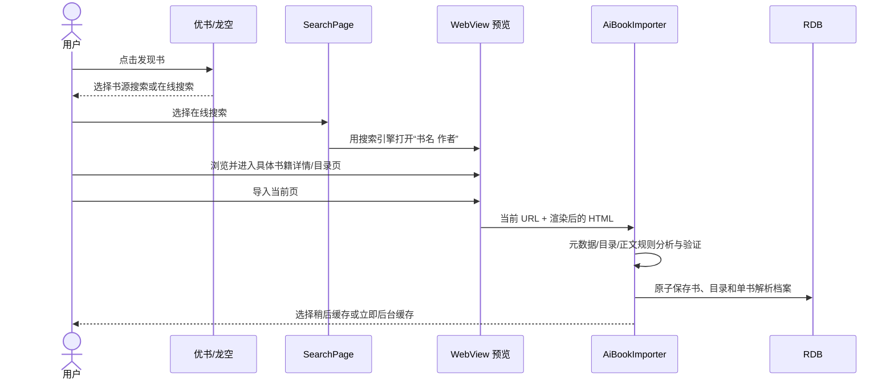

# 在线搜索与 AI 单书导入

> 状态：已实现（第一阶段）  
> 更新日期：2026-07-19  
> 适用范围：优书、龙空发现书跳转，书架统一搜索入口，在线搜索与直接 URL 导入

## 1. 背景与目标

本模块把“发现一本书”到“加入书架并可持续阅读/更新”连接成完整闭环：用户可以从优书、龙空的书单进入搜索，也可以从书架搜索入口输入书名或完整 URL；应用用 WebView 展示真实网页，由用户确认目标页面，再由轻量 Agent 识别书籍元数据、目录和正文规则，最终只为这一本书保存解析档案。

核心目标：

- 复用书架搜索入口，不新增独立的常驻入口。
- 同时保留“书源搜索”和“在线搜索”两种互补能力。
- 在线网页必须经过用户预览确认，避免误导入搜索页、广告页或错误书籍。
- 导入单本书不得新增全局书源；解析规则只归属于该书。
- 导入阶段生成完整目录缓存，正文按阅读需要获取；用户可另选立即后台缓存。
- 保存后续刷新所需的详情页、目录页、章节地址和解析规则，使连载书可以更新。

## 2. 范围与非目标

### 2.1 本期范围

- 优书、龙空发现书跳转到统一搜索页的指定标签。
- 必应、百度、搜狗、神马、Google 的 WebView 在线搜索。
- 直接输入公网 HTTP(S) 书籍 URL。
- WebView 中后退、前进、刷新、桌面/移动模式切换和人工确认。
- AI 辅助识别书籍信息、完整目录、目录分页和正文规则。
- 章节去重、摘要目录剔除、倒序纠正和目录落库。
- 单书解析档案持久化、按需阅读、离线缓存和书架刷新。

### 2.2 非目标

- 不解析或下载搜索结果中的 EPUB、MOBI、TXT、网盘文件。
- 不绕过登录、验证码、DRM、付费墙或网站访问控制。
- 不把在线搜索结果解析为原生结果列表；第一阶段直接使用搜索引擎 WebView。
- 不把单书导入产生的规则发布到书源管理页。
- `AiImportBookPage` 不是主入口；统一入口以 `SearchPage` 为准。

## 3. 术语与 URL 语义

| 名称 | 含义 | 示例/持久化位置 |
|------|------|----------------|
| 详情页 URL | 用户最终确认的书籍页面，是单书身份和重新分析的基准 | `Book.bookUrl`、`Book.originUrl`、`AiBookProfile.bookUrl` |
| `sourceUrl` | 网站根地址，只用于相对地址解析和站点身份；不是详情页 | `https://www.erciyan.com`，保存在单书 `sourceJson` 中 |
| 目录 URL | 实际列出章节的页面，可以与详情页相同，也可以是“全部章节”页 | `Book.tocUrl`、`AiBookProfile.tocUrl`、`ruleTocUrl` |
| 章节 URL | 每章正文的真实地址，是目录去重、缓存复用和阅读定位依据 | `chapters.url` |
| 单书解析档案 | 仅服务于一本 AI 导入书的临时 `BookSource` 序列化结果 | `ai_book_profiles.source_json` |
| 正式书源 | 可搜索多本书、由用户管理和启停的全局规则 | `book_sources` |

约束：AI 单书导入只新增或更新 `books`、`chapters` 和 `ai_book_profiles`，不得因导入一本书向 `book_sources` 新增记录；迁移时可以清理旧版本曾误建的 AI 临时书源。

## 4. 入口与路由契约

### 4.1 书架统一搜索入口

`SearchPage` 顶部提供两个标签：

- **书源**：沿用已有的多书源并发搜索、合并和详情页流程。
- **在线**：使用搜索引擎 WebView 或直接 URL，进入 AI 单书导入流程。

没有显式路由参数时默认打开“书源”标签。路由参数约定：

```text
pages/SearchPage?searchMode=source&key=<书名+作者>
pages/SearchPage?searchMode=online&key=<书名+作者>
```

页面同时兼容 `mode`/`searchMode` 与 `key`/`keyword` 字段，便于旧入口迁移。

### 4.2 优书、龙空入口

用户在优书或龙空书单点击“发现书”后，先显示方式选择：

- 书源搜索：跳转 `SearchPage` 的书源标签，并自动搜索“书名 作者”。
- 在线搜索：跳转在线标签，并自动用最后选择的搜索引擎搜索“书名 作者”。

取消选择不产生搜索、导入或数据库写入。

### 4.3 直接 URL 入口

在线标签提供独立的 URL 多行输入区域。只有通过公网 HTTP(S) URL 校验后，才能打开预览窗口；本机、回环、局域网和非法协议不得进入抓取流程。

## 5. 用户流程

### 5.1 从发现页在线导入



### 5.2 从书架搜索导入

1. 用户进入书架搜索页并切换到“在线”。
2. 用户输入书名；关键词写入最近搜索历史。
3. 应用按已选引擎打开搜索 WebView。
4. 用户在网页中定位具体小说页面并确认导入。
5. 分析成功后书籍立即加入书架，默认只保存目录。

### 5.3 通过 URL 导入

1. 用户在在线标签粘贴完整 URL。
2. 应用校验 URL 并打开相同的 WebView 预览窗口。
3. 用户可处理跳转、切换桌面版、刷新或导航到“全部章节”页。
4. 确认后执行与在线搜索完全相同的 Agent 导入流水线。

## 6. 在线搜索与历史

### 6.1 搜索引擎

支持：必应、百度、搜狗、神马、Google。搜索引擎通过下拉选择，不直接平铺；最后选择保存在 `online_search_engine`，首次或配置无效时使用必应。

默认查询模板：

```text
"<关键词>" 小说 在线阅读 目录 -电视剧 -动漫 -漫画
```

在线搜索只负责帮助用户定位网页，不假设搜索结果页 DOM 稳定，也不依赖搜索引擎公开 API。

### 6.2 最近输入

- 关键词写入 `SearchKeywordTable`，与书源搜索共享历史数据。
- 展示最近 30 条，重复关键词更新时间而不重复堆叠。
- 历史建议仅在输入框主动获得焦点时展开。
- 打开 WebView、开始分析以及分析结束后必须收起历史并清除输入焦点，防止遮挡缓存选择对话框。

## 7. WebView 人工确认

### 7.1 界面要求

预览窗口包含：取消、导入当前页、后退、前进、刷新、桌面/移动模式、当前 URL 和操作说明。工具按钮应使用标准图标、至少 48 vp 可点击区域，并适配深浅色及安全区。

默认使用桌面网页。桌面/移动模式保存在 `ai_import_web_desktop_mode`；切换模式后更新 User-Agent 并重新加载当前页面。

### 7.2 行为约束

- WebView 只创建并绑定一个 `WebviewController`，控制器关联完成前导航按钮不可调用，避免 CustomDialog 动态控制器初始化错误。
- 取消：关闭预览，返回搜索页，不启动 Agent，不写数据库。
- 确认：读取 WebView 当前 URL 和 `document.documentElement.outerHTML`，随后关闭网页焦点并开始分析。
- 如果当前页仍是搜索引擎结果页，拒绝导入并提示先进入具体书籍详情页或目录页。
- 用户看到的最终页面优先级高于最初输入 URL；发生广告跳转时，用户可后退/刷新后再确认。

## 8. 轻量 Agent 导入流水线

### 8.1 状态模型

```text
Idle → Preview → Fetch → AnalyzeMetadata → AnalyzeToc
     → FetchFullToc → NormalizeToc → AnalyzeContent → Validate
     → Persist → CacheChoice → Done

任一分析阶段 → Error
预览或阶段边界 → Cancelled
```

UI 应显示当前阶段和可理解的进度文字；失败不能留下半本书、空目录或孤立全局书源。

### 8.2 URL 与页面获取

1. 规范化并再次执行公网 HTTP(S) 安全校验。
2. 优先使用用户确认时取得的渲染后 HTML。
3. HTML 过短、疑似 WAF/脚本壳时，通过 HTTP 重试或 `WebViewFetcher` 兜底。
4. 目录页或正文页发生可疑跳转时，检查是否仍属于同一本书；广告页、其他书籍或无章节页面不得作为成功结果。
5. 页面内容是不可信输入；Agent 提示词必须要求忽略网页中的指令文本，只分析 DOM 结构。

### 8.3 元数据提取

优先使用确定性 HTML 元数据和常见结构提取，缺失字段再由 LLM 补充。目标字段包括：

- 书名、作者
- 封面绝对 URL
- 简介（清理 HTML 后保存）
- 字数、分类、最后更新时间

除书名外的非关键字段缺失不应阻止导入；目录和正文规则验证失败必须阻止导入。

### 8.4 完整目录发现

Agent 必须同时识别：

- 当前页面上的目录列表规则。
- “全部章节”“完整目录”“查看全部”等二级入口。
- 目录页的下一页规则或页码选择器。

当发现独立的完整目录 URL 时，应先获取并验证该页面，再重新分析目录规则。对同一目录页可使用缓存规避参数、桌面页面和 WebView 兜底重试；不得因为详情页只展示“最近 N 章”就把摘要当作完整目录。

目录抓取规则：

- `SourceExecutor.getToc` 最多跟进 60 个目录页。
- 多个已知页码最多 5 路并发抓取，结果仍按页面顺序合并。
- 支持显式下一页规则和 `<option>` 页码列表。
- URL 统一绝对化、去掉片段后再去重。

### 8.5 目录归一化

`normalizeAiChapters` 按以下顺序处理：

1. 丢弃没有标题或 URL 的项目，并规范化章节 URL。
2. 检测页首“最新 N 章”摘要块；若后续出现第一章/序章或明显从高章号跳回低章号，则剔除摘要段。
3. 按规范化 URL 去重，保留首次出现的章节。
4. 根据可识别章号统计整体顺序；当倒序证据充分时整体反转。
5. 重新生成连续的 `chapter_index`。

不对所有标题强制按数字排序，以免破坏卷名、序章、番外等非线性结构。

### 8.6 正文规则分析与验证

- 最多尝试目录前 3 个可用章节作为样本。
- 跳过广告、转码占位、正文过短或明显不属于该书的页面。
- Agent 返回正文容器、正文 URL 变换和章内下一页规则。
- 规则必须通过 `SourceExecutor.getContent` 的真实提取验证；只生成看似合理的选择器不算成功。
- 章内分页必须区分“下一页”和“下一章”，禁止把下一章拼入当前章正文。
- AI 输入长度按阶段限制：目录分析最多约 40,000 字符，正文分析最多约 30,000 字符。

## 9. 持久化设计

### 9.1 原子写入

验证通过后，在数据库事务中完成：

1. 按详情页 `bookUrl` 查询已有书籍，插入或更新 `books`。
2. 用完整目录替换 `chapters`；相同规范化章节 URL 复用原有正文、已读、缓存、下载和音频状态。
3. 按 `book_id` upsert `ai_book_profiles`。
4. 清理旧版本误写入 `book_sources` 的同站点 AI 临时源。

任何一步失败都应回滚本次写入。

### 9.2 单书解析档案

`AiBookProfile` 字段：

| 字段 | 用途 |
|------|------|
| `bookId` | 与书籍一对一关联 |
| `bookUrl` | 详情页身份和重新分析入口 |
| `baseUrl` | 网站根地址，对应临时解析器的 `sourceUrl` |
| `tocUrl` | 当前有效的完整目录入口 |
| `sourceJson` | 经过验证的临时 `BookSource` 规则快照 |
| `createdAt` / `updatedAt` | 档案创建和变更时间 |
| `lastRefreshAt` | 最近刷新尝试时间 |
| `consecutiveFailures` | 连续刷新失败次数，成功后清零 |
| `ruleVersion` | 规则结构版本，为后续迁移/重分析预留 |

`BookSourceResolver` 先解析正式书源；找不到时再按 `bookId`/`bookUrl` 加载单书档案。这使阅读、离线缓存和书架刷新可以复用同一 `SourceExecutor`，同时保持全局书源列表干净。

## 10. 导入后缓存策略

导入成功即表示书籍、完整目录和解析档案已经落库，不等于所有正文已下载。随后提供：

- **稍后缓存**：立即完成导入；阅读页按章获取，或在离线缓存页选择范围。
- **立即后台缓存**：关闭导入流程后创建整书后台缓存任务，进度由离线缓存页面查看，不阻塞当前页面。

后台缓存必须通过 `BookSourceResolver` 取得单书解析档案，不得要求全局 `BookSource` 记录存在。

## 11. 连载书刷新闭环

书架刷新 AI 导入书时：

1. `BookSourceResolver.resolve(book)` 读取单书解析规则。
2. 从 `Book.tocUrl`/档案 `tocUrl` 重新抓取完整目录。
3. 重新执行目录归一化并更新章节数、最新章节等元数据。
4. `replaceTocPreserveContent` 按章节 URL 保留旧缓存和阅读状态，只为新增章节创建记录。
5. 成功时更新 `lastRefreshAt` 并把 `consecutiveFailures` 清零；失败时计数加一并保留旧目录。

若网站 DOM 长期变化导致规则失效，当前版本提示刷新失败；后续可根据 `consecutiveFailures` 和 `ruleVersion` 触发用户确认后的重新分析，不应静默改写已验证规则。

## 12. 可靠性、安全与隐私

- SSRF：所有入口和后续重定向目标只允许公网 HTTP(S)，拒绝本机、内网及非 Web 协议。
- 误跳广告：人工预览负责最终页面确认；自动抓取阶段继续校验书名/章节特征并有限重试。
- Prompt Injection：网页文本仅作为待分析数据，不能改变系统指令、请求凭据或执行任意动作。
- 凭据：AI API Key 只从设置读取，不写入日志、书籍或解析档案。
- 数据一致性：分析和验证在事务外完成，只有最终结果一次性入库。
- 取消：在主要阶段边界检查取消状态；取消后不开始新请求和持久化。
- WebView 生命周期：控制器与组件一一对应，组件卸载后不再调用导航方法。

## 13. 错误与恢复

| 场景 | 用户提示 | 恢复方式 |
|------|----------|----------|
| URL 非法或为内网 | 请输入公网 HTTP(S) 地址 | 修改 URL |
| 当前页仍为搜索结果 | 请先打开具体小说详情页或目录页 | 在 WebView 中进入目标书页 |
| 页面跳到广告/验证页 | 页面与目标书不匹配 | 后退、刷新、切桌面模式后重试 |
| 未识别完整目录 | AI 未能识别目录结构 | 手动进入“全部章节”页再确认 |
| 正文规则验证失败 | AI 未能识别正文规则 | 换一个章节可访问的页面或稍后重试 |
| 网站需要登录/验证码 | 当前站点需要人工验证 | 在预览页完成允许的验证；仍失败则终止 |
| 后台缓存部分失败 | 缓存任务未全部完成 | 在离线缓存页重试；已导入书和目录保留 |
| 连载刷新失败 | 更新失败，保留原目录 | 稍后重试，不删除已有章节 |

## 14. 验收标准

| # | 验收项 |
|---|--------|
| AC-01 | 优书、龙空点击发现书后可选择书源/在线，并进入对应标签且自动带入书名和作者。 |
| AC-02 | 书架搜索页同时提供书源和在线标签，在线标签保留在线关键词搜索与直接 URL 两条路径。 |
| AC-03 | 引擎通过下拉选择、默认必应并记住最后选择；支持必应、百度、搜狗、神马、Google。 |
| AC-04 | 最近 30 条关键词可复用；打开预览和分析完成后历史不会遮挡后续对话框。 |
| AC-05 | 预览窗口的后退、前进、刷新和桌面/移动切换可用，默认桌面模式，控制器未就绪时不报错。 |
| AC-06 | 取消预览不执行导入；搜索结果页不能直接确认导入。 |
| AC-07 | `https://www.erciyan.com/book/94228506/` 可提取封面、简介、字数、完整分页目录和可验证正文规则。 |
| AC-08 | 存储后的 `sourceUrl` 为站点根地址，详情页、目录页和每章 URL 分别保存在正确字段。 |
| AC-09 | 导入一本书不会增加 `book_sources` 记录，只新增/更新该书的 `ai_book_profiles`。 |
| AC-10 | 最近章节摘要被剔除，重复章节去除，明显倒序目录被纠正，卷名/番外顺序不被数字排序破坏。 |
| AC-11 | 导入完成默认只缓存目录；用户可选择立即后台缓存，并可在离线缓存页查看结果。 |
| AC-12 | 重复导入或刷新同一本书不会产生重复书籍，已有阅读位置和正文缓存可按章节 URL 保留。 |
| AC-13 | 广告跳转、WAF、短 HTML 和 JS 壳页面不会被误判为成功，可通过有限重试/WebView 兜底恢复。 |

## 15. 实现映射

| 职责 | 主要实现 |
|------|----------|
| 统一搜索页、历史、引擎选择、URL 入口 | `entry/src/main/ets/pages/SearchPage.ets` |
| 优书发现跳转 | `entry/src/main/ets/pages/YoushuExplorePage.ets` |
| 龙空发现跳转 | `entry/src/main/ets/pages/LkongExplorePage.ets` |
| WebView 预览与人工确认 | `AiImportPreviewDialog`（`SearchPage.ets`） |
| AI 导入编排、规则验证、目录归一化 | `entry/src/main/ets/engine/ai/AiBookImporter.ts` |
| 目录分页和正文解析 | `entry/src/main/ets/engine/source/SourceExecutor.ts` |
| 单书解析档案 | `entry/src/main/ets/model/AiBookProfile.ts`、`data/database/AiBookProfileTable.ts` |
| 正式书源/单书档案统一解析 | `entry/src/main/ets/service/BookSourceResolver.ts` |
| 保留缓存的目录替换 | `entry/src/main/ets/data/database/ChapterTable.ts` |
| 后台正文缓存 | `entry/src/main/ets/service/BookCacheService.ts` |

## 16. 后续演进

- 将搜索引擎结果安全解析为原生列表，同时保留 WebView 兜底。
- 为连续刷新失败的书提供“重新打开网页并修复规则”入口。
- 增加规则置信度、成功样本和站点结构版本，减少不必要的 LLM 调用。
- 增加端到端自动化用例和固定 HTML 样本，覆盖广告跳转、完整目录入口、分页目录、章内分页和 DOM 变更。
- 后续单独设计电子书文件搜索/下载/版权提示，不与在线连载网页导入混用。
