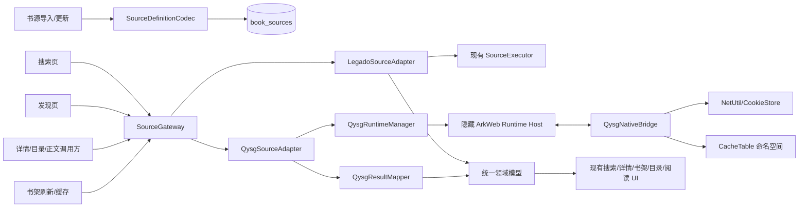
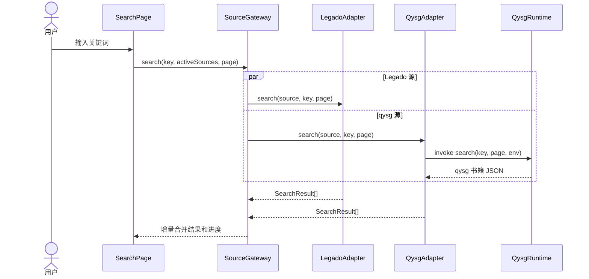

# 轻悦时光（qysg）书源兼容设计

> 状态：设计完成，待分阶段实现  
> 更新日期：2026-09-01  
> 适用范围：qysg 书源导入、搜索、发现、详情、目录、正文，以及现有书架和阅读页面复用

## 1. 结论

LegadoHOS 可以兼容 qysg 书源，但不应把 qysg HTML 当成 Legado JSON 规则，也不应直接交给当前 QuickJS `ScriptEngine` 执行。

推荐方案是：

1. 新增独立的 `QysgSourceAdapter` 和隐藏 ArkWeb 运行时，按 qysg 原本的 WebView 语义执行完整 HTML/JavaScript。
2. 在现有 `SourceExecutor` 上方增加统一的 `SourceGateway`，按书源格式分发到 Legado 或 qysg 适配器。
3. qysg 返回值统一映射为现有 `SearchResult`、`BookSourceBookInfo`、`BookSourceChapter` 和正文结果。
4. 搜索页、发现页、书籍详情、书架、目录页、文本阅读器和漫画阅读器继续使用现有展示与持久化逻辑，不分别添加 qysg 判断。

这样可以同时满足两点：qysg 按自己的协议运行，现有阅读业务不复制一套页面。

## 2. 依据和现状

qysg 官方说明明确以 WebView 运行书源，核心生命周期为异步 JavaScript 函数：

| 能力 | qysg 函数 | 返回值 |
|------|-----------|--------|
| 搜索 | `search(key, page[, env])` | 书籍数组 JSON |
| 搜索筛选 | `filter()` | 筛选描述或页面 |
| 详情 | `info(bookUrl)` | 单本书 JSON |
| 目录 | `chapter(tocUrl[, bookUrl])` | 章节数组 JSON |
| 正文 | `content(chapterId[, bookUrl])` | 文本、音频地址或含图片 HTML |
| 发现入口 | `getfinds()` | 发现项数组 JSON |
| 发现取书 | `find(url, page)` | 书籍数组 JSON |
| 发现筛选 | `findfilter(url)` | 筛选描述或页面 |
| 登录/购买 | `getloginurl()`、`login()`、`pay()` | 可选扩展 |
| 图片解密 | `imagedecrypt(url, image)` | 解密后的字节数组 |

官方协议及桥接样例见 [qysg README](https://github.com/autobcb/qysg/blob/main/README.md) 和 [默认书源模板](https://github.com/autobcb/qysg/blob/main/default.html)。

用户提供的“笔趣阁345”样本包含：

- 顶层字段：`bookSourceUrl`、`bookSourceName`、`enabledExplore`、`enabled`、`bookSourceGroup`、`author`、`help`、`html` 等。
- `html` 内实现了 `search/filter/findfilter/info/chapter/content/getfinds/find`。
- 主要实际依赖为 DOM/jQuery、`http.Get/Post`、`CookieJar`、`getsearch`、`log`、`text` 和 `showToast`。
- `pay/login/imagedecrypt` 在该样本中为空，因此可以作为第一阶段端到端验收源。

当前 LegadoHOS 的关键限制：

- `BookSourceTable.importSources()` 只按 Legado `parseBookSource()` 解析。
- `SourceExecutor.searchSingle()` 要求存在 `ruleSearchUrl`，qysg 源没有该字段。
- 当前 QuickJS 调用是同步取值，不能正确等待 qysg 的异步函数。
- QuickJS 环境没有 `window`、`document`、jQuery 和 `flutter_inappwebview`。
- `WebViewFetcher` 的职责是加载网页并提取 HTML，不是长期驻留的书源脚本运行时。

因此兼容点应放在“书源协议适配层”，而不是继续扩充 Legado 规则解析分支。

## 3. 范围和非目标

### 3.1 目标范围

- 导入、预览、更新、启停、分组、导出 qysg JSON。
- 搜索、搜索分页及现有多书源结果合并。
- `getfinds/find` 发现入口、分类布局和分页。
- 详情、目录、正文，以及加入书架后的刷新、缓存和继续阅读。
- 文本、音频、漫画类型的结果传播；第一阶段优先打通文本。
- qysg HTTP、缓存、Cookie、日志等基础桥接。
- 登录、验证码、前台 WebView、购买、图片解密等能力按阶段扩展。

### 3.2 非目标

- 不把 qysg HTML 自动翻译成 Legado 选择器规则。
- 不承诺第一阶段支持所有 qysg 原生 UI、段评、支付和媒体扩展。
- 不允许书源 JavaScript 直接获得任意 ArkTS/NAPI 能力。
- 不改变现有书架、详情页和阅读器的视觉结构。

## 4. 总体架构



核心原则：页面只依赖统一领域模型和 `SourceGateway`，不依赖书源格式。

## 5. 统一书源协议

新增书源适配接口，建议放在 `entry/src/main/ets/engine/source/adapter/`：

```typescript
export interface OnlineSourceAdapter {
  readonly format: BookSourceFormat;

  canSearch(source: BookSource): boolean;
  canExplore(source: BookSource): boolean;

  search(source: BookSource, key: string, page: number,
    context?: SourceCallContext): Promise<SearchResult[]>;

  getExploreItems(source: BookSource,
    context?: SourceCallContext): Promise<SourceExploreItem[]>;

  explore(source: BookSource, item: SourceExploreItem, page: number,
    context?: SourceCallContext): Promise<SearchResult[]>;

  getBookInfo(source: BookSource, bookUrl: string,
    context?: SourceCallContext): Promise<BookSourceBookInfo>;

  getToc(source: BookSource, tocUrl: string, bookUrl?: string,
    context?: SourceCallContext): Promise<BookSourceChapter[]>;

  getContent(source: BookSource, chapterUrl: string, bookUrl?: string,
    context?: SourceCallContext): Promise<SourceContentResult>;
}
```

其中：

- `LegadoSourceAdapter` 只委托现有 `SourceExecutor`，不修改规则语义。
- `QysgSourceAdapter` 调用 `QysgRuntimeManager` 并负责结果映射。
- `SourceGateway` 对外保留与当前调用相近的签名，统一处理并发、超时、取消、增量进度和错误隔离。
- 可选能力通过 `SourceCapabilities` 描述，页面不得用 `ruleSearchUrl` 是否为空判断能否搜索。

建议的能力模型：

```typescript
export interface SourceCapabilities {
  searchable: boolean;
  explorable: boolean;
  pageableSearch: boolean;
  pageableExplore: boolean;
  login: boolean;
  pay: boolean;
  imageDecrypt: boolean;
  foregroundWebView: boolean;
}
```

### 5.1 SourceGateway 替换范围

以下现有调用应逐步从 `globalSourceExecutor` 切换到 `globalSourceGateway`：

- `SearchPage`、`ExploreBookPage`、`ChangeSourcePage`。
- `BookInfoPage`、`ChapterListPage`、`ReadPage`、`ComicReadPage`。
- `BookshelfPage`、`BookCachePage`、`BookCacheService`。
- `SourceChecker`、`SourceSwitcher`、`BookshelfTransferService`。

`SourceExecutor` 保留为 Legado 专用执行器，避免它同时承担两种不相容的规则协议。

## 6. 数据模型和导入

### 6.1 格式标识

新增：

```typescript
export enum BookSourceFormat {
  LEGADO = 0,
  QYSG = 1,
}
```

`BookSource` 增加 `sourceFormat`。数据库 `book_sources` 增加：

```sql
source_format INTEGER DEFAULT 0
```

qysg 的完整原始 JSON（包括 `html`）继续只保存在现有 `raw_json` 中，不另存一份 HTML，避免重复占用空间。运行时通过 `QysgSourceCodec` 按需解码为 `QysgSourceDefinition`。

`source_type` 仍表示内容类型，不能复用为协议格式。qysg 每本书都可能返回不同的 `type`，建议增加 `BookSourceType.MIXED = 4`，并在结果层按单本书的实际类型覆盖。

### 6.2 Codec 注册表

将 `BookSourceTable` 直接调用 `parseBookSource()` 改为：

```text
JSON 文本
  → SourceDefinitionCodec.detect(raw)
  → LegadoSourceCodec.decode(raw) 或 QysgSourceCodec.decode(raw)
  → BookSource 公共字段
  → raw_json 原样持久化
```

格式识别规则：

1. `html` 为非空字符串，并包含 qysg 生命周期函数或 `flutter_inappwebview.callHandler` 时识别为 qysg。
2. 存在 `ruleSearch`、`searchUrl`、`ruleContent` 等 Legado 字段时识别为 Legado。
3. 同时命中时在导入预览中提示冲突，不执行源代码，由用户确认格式。
4. 两种都未命中则拒绝导入并说明缺少的必需字段。

qysg 公共字段映射：

| qysg | BookSource |
|------|------------|
| `bookSourceName` | `sourceName` |
| `bookSourceUrl.trim()` | `sourceUrl` |
| `bookSourceGroup` | `group` |
| `enabled` | `enabled` |
| `enabledExplore` | `enabledExplore` |
| `lastUpdateTime` | `updateTime` |
| `html` | 仅保留在 `rawJson`，由 codec 按需读取 |
| `author/help/login` | 保留在 qysg 原始定义中 |

用户样本的 `bookSourceUrl` 带前导空格，导入身份比较前必须 `trim()`，并将规范化值写回导出结果，防止产生重复源。

### 6.3 导入预览与更新

导入预览增加“格式”列或标签：`Legado` / `轻悦时光`，并展示：

- 源名称、规范化 URL、分组、更新时间。
- 是否包含搜索、发现、登录、购买、图片解密能力。
- “该书源包含可执行 HTML/JavaScript”安全提示。
- 新增、更新、已存在状态继续按规范化 `sourceUrl` 判断。

导入阶段只做静态检查，不运行 qysg HTML。推荐限制单源 HTML 大小，例如 2 MiB；超限时拒绝并提示。

更新源时保留现有名称、分组、启用状态的逻辑不变；替换 `raw_json` 后让 `QysgRuntimeManager.invalidate(sourceUrl)` 销毁旧运行时，下一次调用重新加载。

### 6.4 导出和备份

- qysg 导出必须走 `QysgSourceCodec.encode()`，以原始 JSON 为基底，仅回写用户可编辑的公共字段。
- 不得用 `bookSourceToJsonObject()` 把 qysg 转成 Legado JSON。
- 现有备份包含书源导出时，自动包含完整 `html`；书籍、章节和阅读进度备份格式无需变化。

## 7. qysg ArkWeb 运行时

### 7.1 为什么使用 ArkWeb

qysg 书源的目标运行环境就是浏览器：常见源会使用 DOM、jQuery、外部 `<script>`、`async/await` 和 Promise。使用 ArkWeb 能保留这些行为，兼容成本和后续偏差均低于在 QuickJS 中模拟整个浏览器环境。

当前 QuickJS 仍用于 Legado 字段脚本，不承担 qysg 运行。

### 7.2 组件划分

建议新增：

```text
entry/src/main/ets/engine/qysg/QysgSourceCodec.ts
entry/src/main/ets/engine/qysg/QysgSourceAdapter.ts
entry/src/main/ets/engine/qysg/QysgResultMapper.ts
entry/src/main/ets/engine/qysg/QysgRuntimeManager.ts
entry/src/main/ets/engine/qysg/QysgNativeBridge.ts
entry/src/main/ets/engine/qysg/QysgHttpBridge.ts
entry/src/main/ets/components/QysgRuntimeHost.ets
```

`QysgRuntimeHost` 是至少 1×1 的隐藏 `Web` 组件，不能设为 0×0。它在控制器绑定后注册窄接口 JavaScript Proxy，并向 `QysgRuntimeManager` 注册运行槽位。

主入口 `MainPage` 挂载常驻 Host；需要独立启动且可能脱离 `MainPage` 的阅读/调试页面挂载兜底 Host。`RuntimeManager` 对重复 Host 去重，只使用已绑定控制器。

### 7.3 启动顺序

每个运行槽位加载源时：

1. 从 `raw_json` 取得 qysg `html`。
2. 在源脚本之前注入引导脚本，创建 `window.flutter_inappwebview.callHandler`。
3. 以规范化 `bookSourceUrl` 作为 base URL 加载组合后的 HTML，保证相对资源地址可解析。
4. qysg 构造函数调用 `CookieJar` 后，桥接层标记运行时 ready。
5. 若源未主动调用 `CookieJar`，在 DOM 完成且短暂宽限后按“无 CookieJar 模式”就绪。
6. 探测 `search/info/chapter/content/getfinds/find` 等全局函数，形成能力快照。

超时或脚本异常时销毁该槽位，下一次调用重新加载，不能让损坏的全局状态继续服务其他请求。

### 7.4 异步调用协议

不能依赖 `runJavaScript()` 直接返回 Promise 的最终值。采用 operation id 回调协议：

```javascript
window.__qysgHost.invoke = async function (operationId, method, argsJson) {
  try {
    const args = JSON.parse(argsJson);
    const fn = globalThis[method];
    if (typeof fn !== 'function') throw new Error('unsupported method: ' + method);
    const value = await Promise.resolve(fn(...args));
    await qysgNative.complete(operationId, true, JSON.stringify(value ?? null));
  } catch (error) {
    await qysgNative.complete(operationId, false, String(error?.stack || error));
  }
};
```

ArkTS 侧保存 `operationId → Promise resolver`，统一设置搜索/详情/目录/正文超时，并在页面取消、运行时重载或应用退后台时结束未完成请求。

### 7.5 运行池和并发

- 默认最多 2 个 qysg ArkWeb 槽位；Legado 搜索仍使用当前配置的并发数。
- 同一 qysg 源的调用串行执行，避免全局变量、当前书变量和临时 DOM 相互覆盖。
- 不同 qysg 源可在不同槽位并行。
- 槽位按 `sourceUrl + updateTime` 标识，空闲一段时间后回收。
- 原生缓存和 Cookie 不随 WebView 槽位回收而丢失。

纯后台任务若没有已绑定的 ArkWeb Host，第一阶段应延迟到前台执行并记录原因，不能静默返回空内容。

## 8. `flutter_inappwebview` 桥接

引导脚本把 qysg 的多参数调用序列化后交给唯一的原生入口：

```typescript
callHandler(handler: string, argsJson: string): Promise<string>
```

返回统一 envelope：

```json
{"ok":true,"value":null,"error":""}
```

JavaScript shim 解析 envelope 后返回 `value`，使源代码看到的行为与原桥一致。

### 8.1 第一阶段桥接

| handler | HOS 实现 | 说明 |
|---------|-----------|------|
| `CookieJar` | Runtime ready + Cookie 策略 | 必须优先实现 |
| `http` | `QysgHttpBridge` | GET/POST/HEAD、重定向、响应头、二进制 body |
| `cache.get/set/remove` | `CacheTable` | key 加书源命名空间 |
| `cache.allget/allset/allremove` | `CacheTable` | 全局命名空间与普通命名空间分离 |
| `cookie.get/set/remove/setcookie/getCookie` | `CookieStore` | 按 URL host 管理 |
| `getsourceurl` | 当前源 URL | 返回规范化 URL |
| `getsearch` | 当前搜索类型/环境 | 无设置时返回兼容默认值 |
| `log` | 书源日志缓冲 | 自动脱敏 Cookie/token |
| `text` | 调试源码缓冲 | 仅调试页展示，限制长度 |
| `showToast/showLongToast` | UI 事件队列 | 仅前台且限频 |
| `base64encode/base64decode` | ArkTS util | 字符串转换 |
| `utf8ToGbkUrlEncoded` | 复用 `NetUtil` 编码 | 搜索编码 |
| `toSimplified/toTraditional` | 文本转换服务 | 无能力时返回原文并记录降级 |
| `getWebViewUA/device/version/buildNumber/getWidth/getHeight` | 应用环境 | 返回稳定、最少必要信息 |

“笔趣阁345”完成搜索到正文主要依赖该阶段能力。

`http` 必须返回 qysg 约定的结构：

```typescript
interface QysgHttpResponse {
  method: string;
  body: string; // 原始响应字节的 Base64
  headers: Record<string, string[]>;
  statusCode: number;
  statusMessage: string;
  data: string; // 按响应头/页面声明解码后的文本
}
```

现有 `NetUtil.httpGet/httpPost` 只返回文本，不足以构造完整结构。应在 `NetUtil` 增加可复用的 detailed/raw response API，让 qysg 桥接继续继承现有代理、DNS、超时、Cookie 和取消策略，而不是另写一套网络栈。

### 8.2 第二阶段桥接

- `webview`、`webviewajax`、资源 URL 捕获。
- `startBrowser`、`startBrowserWithShouldOverrideUrlLoading`。
- `getVerificationCode`、登录 UI、`getLoginUser`。
- `filter/findfilter` 的受控筛选页面。
- `refreshExplore/refreshContent` 等前台刷新事件。

这些能力必须通过页面事件总线触发现有对话框或 WebView，不允许 qysg 脚本直接持有 UI 对象。

### 8.3 第三阶段桥接

- `pay` 和购买后刷新。
- `imagedecrypt`、图片后缀参数、`imageDecode`。
- `dp:` 段评图片、图片点击 JS。
- 视频、语音和其他媒体扩展。
- `addbook/searchbook` 等会写业务数据的动作。

会产生外部跳转、购买或数据写入的 handler 必须要求明确的前台用户操作；后台书源调用只能返回“不允许”。

## 9. 结果映射

### 9.1 书籍

qysg 书籍对象映射到 `SearchResult`：

| qysg | SearchResult |
|------|--------------|
| `bookUrl` | `noteUrl`，并参与 `key` |
| `name` | `name` |
| `author` | `author` |
| `coverUrl` | `coverUrl` |
| `kind` | `kind` |
| `wordCount` | `wordCount` |
| `intro` | `introduce` |
| `latestChapterTitle` | `latestChapterTitle` |
| `type` | 新增 `contentType` |
| 当前源 | `origin/originUrl` |

`SearchResult` 建议新增：

```typescript
contentType?: BookType;
originRefs?: SourceBookRef[];
```

`SourceBookRef` 把 `sourceName/sourceUrl/noteUrl/contentType` 绑定在同一对象中，避免现有三个平行数组在多源合并后错位。旧字段先保留，页面可渐进迁移。

### 9.2 详情

`info()` 的结果映射到现有 `BookSourceBookInfo`，并补充 `contentType`。`bookUrl` 必须保留源返回的身份值；`tocUrl` 为空时回退到 `bookUrl`。

qysg 简介以 `@html:` 开头时保留 HTML 标识给现有简介展示层安全清理；普通内容按文本处理。

### 9.3 目录

| qysg | BookSourceChapter |
|------|-------------------|
| `name` | `title` |
| `chapterId` | `url` |
| `index` | `index` |
| `isPay` | `isPay` |
| `isVip` | `isVip` |
| `isVolume` | `isVolume` |
| `tag` | 新增可选 `tag` |

目录映射后继续走现有章节规范化、`ChapterCache` 和 RDB 持久化。卷名不作为可阅读正文请求，但仍可在目录 UI 中展示。

### 9.4 正文

增加内部类型：

```typescript
export interface SourceContentResult {
  type: BookType;
  raw: string;
  baseUrl?: string;
  headers?: Record<string, string>;
}
```

- 文本：`raw` 交给现有正文清理和 `ReadPage`。
- 漫画：保留 ``，交给现有 `extractImageUrls`、`MangaImageLoader` 和 `ComicReadPage`。
- 音频：把媒体 URL 交给现有音频播放链路。

qysg 图片 `src` 可能附带 `headers/js/imageDecode` 元数据，不能像当前普通 URL 那样直接删除逗号后内容。应新增 `QysgImageRef` 解析器，第一阶段先支持 `headers`，第三阶段再支持 `js/imageDecode`。

## 10. 搜索流程



需要调整的现有判断：

- 搜索源筛选从 `ruleSearchUrl 非空` 改为 `SourceGateway.canSearch(source)`。
- 单源分页、停止搜索、超时隔离和结果排序继续由统一网关保证。
- qysg `search()` 返回非法 JSON、空对象或异常时只标记该源失败，不中断其他源。
- `env` 作为可选第三参数传入，初期至少包含当前搜索模式、应用平台和语言；JS 忽略多余参数是安全的。

## 11. 发现流程

当前 `ExplorePage` 同时承担分类解析、网络请求和 UI 状态，`ExploreBookPage` 又把发现规则临时改写为搜索规则。兼容 qysg 时建议拆出 `ExploreService`：

```typescript
getItems(source): Promise<SourceExploreItem[]>
loadBooks(source, item, page): Promise<SearchResult[]>
```

`SourceExploreItem`：

```typescript
export interface SourceExploreItem {
  id: string;
  title: string;
  target: string; // qysg url 或 Legado 分类 URL
  actionJs?: string;
  kind: 'books' | 'webview' | 'heading';
  flexBasisPercent: number;
  adapterPayload?: string;
}
```

qysg 映射规则：

- `url` 和 `js` 都为空：不可点击的分组标题。用户样本正是用这种项目分隔分类。
- `type=0` 且有 `url`：点击后调用 `find(url, page)`，结果复用 `ExploreBookPage` 书籍列表。
- `type=1` 且有 URL：在受控前台 WebView 打开。
- `js` 非空：由 `QysgSourceAdapter.executeExploreAction()` 在原源运行时执行，UI 不直接 eval。
- `width=0` 映射为 `flexBasisPercent=1/3`（默认一行三项），`width=1` 映射为
  `1/2`（一行两项），`width=3` 映射为 `1`（独占一行）；非法值回退到默认三列。

Legado 侧把当前 `ExplorePage.loadCategories()` 的纯解析逻辑移入 `LegadoExploreAdapter` 或 `ExploreService`，行为保持不变。

`filter()` 和 `findfilter()` 第一阶段允许返回空值；第二阶段增加筛选面板。筛选产生的 URL/状态作为 `adapterPayload` 原样交回 qysg 适配器，页面不理解其内部格式。

## 12. 现有业务复用

### 12.1 加入书架

搜索或发现结果进入 `BookInfoPage` 后，流程与 Legado 书源相同：

1. `BookSourceResolver` 按 `originUrl/sourceUrl` 找到 qysg 源。
2. `SourceGateway.getBookInfo/getToc` 得到统一详情和目录。
3. 现有代码创建或更新 `Book`、`Chapter`，写入相同数据库表。
4. 根据结果的 `contentType` 设置 `Book.type/isManga/isAudio`。

书架不需要 qysg 专属表，也不需要 qysg 专属卡片。

### 12.2 详情和目录

- `BookInfoPage` 保持现有布局、换源、加入书架和开始阅读功能。
- `ChapterListPage` 继续消费统一章节列表。
- `BookSourceResolver` 只负责找源；真正的格式分派由 `SourceGateway` 完成。
- 换源比较、章节数量和最新章节继续使用现有模型。

### 12.3 阅读和缓存

- `ReadPage`、`ComicReadPage`、音频链路只按 `Book.type` 路由，不按 `sourceFormat` 路由。
- `BookCacheService` 调用 `SourceGateway.getContent()`，正文仍写入现有章节缓存。
- 书架刷新调用 `SourceGateway.getToc/getBookInfo()`，更新策略不变。
- qysg 运行时暂不可用时返回明确的可重试错误，不得把空目录覆盖已有目录。

## 13. 安全和稳定性

qysg 书源本质上是第三方可执行代码，必须采用最小权限：

- 每个源运行于独立文档，切换源时清空 JS 全局状态。
- JavaScript Proxy 只暴露 `callHandler` 和 operation 完成回调。
- handler 使用白名单；未知 handler 返回结构化“不支持”，不做动态反射。
- `http/webview/openurl` 只接受允许的协议，并沿用应用网络安全策略。
- Cookie 继续按域名隔离；qysg cache key 再按 sourceUrl 哈希隔离。
- 日志、异常和调试 HTML 对 Cookie、Authorization、token 做脱敏并限制大小。
- 每次操作限制超时、响应大小和重定向次数；运行时连续失败后熔断并允许手动重试。
- 导入时明确提示可执行脚本风险；禁用源不得创建运行时或发起请求。
- 运行槽销毁时调用 `deleteJavaScriptProxy`，结束全部 pending operation，避免内存泄漏。

## 14. 可观测性

统一日志字段：

```text
[Qysg] source=<脱敏源名> op=<search|info|chapter|content|find>
       operationId=<id> phase=<load|invoke|bridge|map>
       duration=<ms> resultCount=<n> error=<code>
```

建议错误码：

- `QYSG_IMPORT_INVALID`
- `QYSG_RUNTIME_UNAVAILABLE`
- `QYSG_RUNTIME_LOAD_TIMEOUT`
- `QYSG_METHOD_UNSUPPORTED`
- `QYSG_BRIDGE_UNSUPPORTED`
- `QYSG_HTTP_FAILED`
- `QYSG_RESULT_INVALID`
- `QYSG_OPERATION_CANCELLED`

书源调试页增加 qysg 标签，显示：能力探测、运行时状态、桥接调用摘要、搜索/详情/目录/正文的原始返回和映射结果。

## 15. 分阶段实施

### 阶段 A：基础协议和导入

- `BookSourceFormat`、`source_format` 数据库列和迁移。
- `SourceDefinitionCodec` 注册表。
- qysg 导入预览、更新、导出和备份往返。
- `SourceGateway`、`LegadoSourceAdapter`，先保证现有 Legado 回归不变。

验收：现有 Legado 源导入/搜索不回归；“笔趣阁345”被识别为 qysg，URL 去除前导空格，导出后 `html` 完整。

### 阶段 B：文本源完整闭环

- ArkWeb Runtime Host、异步 operation 协议。
- 第一阶段 bridge，重点实现完整 `http` 返回结构。
- qysg 搜索、详情、目录、正文映射。
- SearchPage、BookInfoPage、ReadPage、书架刷新和缓存切到 `SourceGateway`。

验收：“笔趣阁345”可搜索、进详情、加载目录、阅读正文、加入书架，重启后仍可刷新和阅读。

### 阶段 C：发现和筛选

- `ExploreService`、`getfinds/find`、发现分页和布局映射。
- `filter/findfilter` 筛选页面。
- `type=1` 前台 WebView 和 action JS。

验收：样本源发现页按分类展示，分类取书可分页，点击结果继续复用详情和阅读页面。

### 阶段 D：高级能力

- 登录、验证码、WebView AJAX/资源捕获。
- 漫画图片参数、headers、`imagedecrypt`。
- 音频、购买、段评和受控业务动作。

验收：分别选取真实登录源、漫画源和音频源做端到端验证；未实现 handler 必须可诊断而不是静默失败。

## 16. 测试计划

### 16.1 单元测试

- qysg/Legado 格式识别、冲突和非法输入。
- `bookSourceUrl` 规范化、重复源更新。
- qysg 书籍、详情、章节、正文映射。
- `sourceType/contentType` 传播。
- bridge 参数与返回 envelope。
- cache 命名空间和 Cookie 域隔离。
- 导入→导出往返保持 `html`。

### 16.2 运行时契约测试

使用内置最小 HTML fixture 覆盖：

- 同步函数、异步 Promise、抛异常、非法 JSON、超时和取消。
- DOM/jQuery 外部脚本加载。
- JS→ArkTS `callHandler`→JS 返回链路。
- Runtime reload、槽位复用和不同源状态隔离。

### 16.3 端到端测试

以用户提供的“笔趣阁345”为第一条固定验收链：

```text
导入 → 启用 → 搜索 → 详情 → 目录 → 正文
     → 加入书架 → 退出重进 → 刷新目录 → 缓存章节
     → 发现 → 分类 → 分页 → 详情
```

同时选取至少一个现有 Legado 文本源和漫画源做回归，确认统一网关没有改变原规则行为。

## 17. 完成标准

满足以下条件才算第一版兼容完成：

1. qysg JSON 可预览导入、更新、启停、分组、导出和备份恢复。
2. 搜索页不再用 `ruleSearchUrl` 排除 qysg 源，多源进度和取消正常。
3. qysg 搜索结果可进入现有详情页并加入书架。
4. 详情、目录、正文由统一网关分派，现有页面无 qysg 专属副本。
5. 加入书架后重启应用仍能刷新目录、继续阅读和缓存正文。
6. `getfinds/find` 可在现有发现 UI 中展示和分页。
7. 不同 qysg 源之间的全局变量、缓存和运行结果不串源。
8. 未支持的 bridge 能力给出明确错误和调试记录，不返回伪成功。
9. 现有 Legado 搜索、详情、目录、正文、漫画和换源回归通过。

## 18. 关键决策摘要

| 决策 | 选择 | 原因 |
|------|------|------|
| qysg 执行环境 | 隐藏 ArkWeb | 原协议依赖浏览器 DOM、jQuery 和异步 Promise |
| 与现有引擎关系 | 新适配器 + 统一网关 | 隔离两种协议，复用业务 UI |
| qysg HTML 存储 | 现有 `raw_json` | 保真且避免重复存储 |
| 协议格式字段 | 新增 `source_format` | 不与内容类型 `source_type` 混用 |
| 发现实现 | `ExploreService` 分派 | qysg `getfinds/find` 不能伪装成 Legado 搜索规则 |
| 首个验收源 | 笔趣阁345 | 基础桥接覆盖完整文本阅读链，暂不依赖支付/解密 |
| 高级能力 | 分期实现 | 登录、图片解密和业务写操作的安全与 UI 成本更高 |
